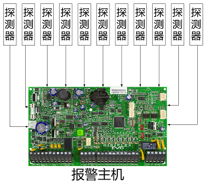
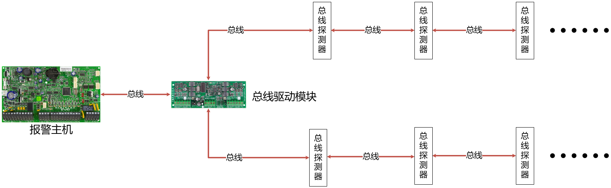
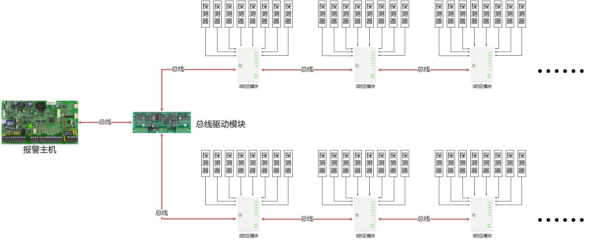
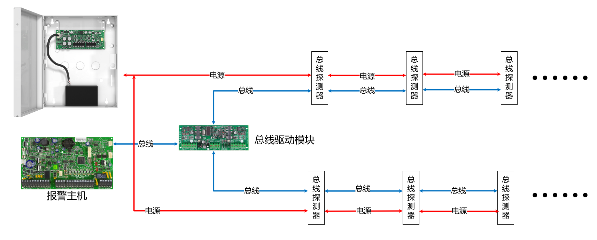
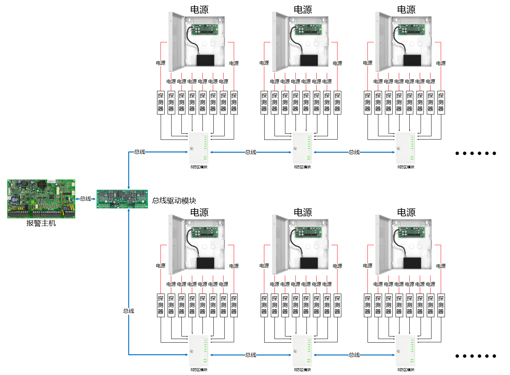

布线是安防系统施工重要的一环，要根据通讯方式选择相应的布线方法。首先，安防系统包含主机、键盘、探测器、警号和其他通讯模块，下面我们以此讨论一下如何专业的布线？

## 键盘布线

---

键盘是4芯总线和主机通讯，其中4根线里面含有电源和信号线，因为键盘和主机之间是串行数据通讯，通常我们建议采用标准4芯带屏蔽的线材布线。如线果没有用带屏蔽的材布线，在施工的过程中，万一和强电并行走线的时候，可能会产生干扰信号，或者附近有强大的电磁信号，都会造成通讯的不畅甚至无法通讯。

## 警号布线

---

警号是安防系统的必备的，对于警号的布线比较简单，2芯线即可，无需带屏蔽，除去线路衰减，只要保证警号端有足够的功率。

## 探测器布线

---

安防系统最耗费线材的就是探测器布线了，因为探测器数量多，安装位置也比较分散。科学的设计布线方式对于系统的稳定性起到决定性的作用，探测器通信方式分为2种，即总线和干接点：

干接点两个接点间没有极性，无电源，可以互换，输出通断信号；

总线是数字通信方式，采用了通信协议，比如常见的485，CAN总线等等，枫叶的总线方式属于枫叶自己研发的通信协议。下文提到的总线即是枫叶总线。

针对于枫叶总线我们建议采用带屏蔽线的RVVP4 x 0.75+线材，干接点通信方式的线材建议RVV4 x 0.75+，其中“+”表示不低于这个规格，可以比这个规格更高。

我们归纳为三种布线方式：

### 探测器布线：干接点

通常情况，如果探测器数量比较少，只有几个，可以采用这种方式。

比如常闭（触发后输出开路信号）输出，如果忽略电阻，理论上传输距离是无限远。用4芯线连接主机和探测器即可，只要线路能满足供电要求即可，不用考虑信号的干扰问题。这种布线方式需要每一个探测器都拉线到主机或者防区模块，需要的线材多，比较浪费。拓扑图如下：

### 探测器布线：总线

注意，如果总线探测器数量超过20个，建议采用混合型布线方式。

探测器带有总线通讯模式，探测器不需要单独走线到主机，共用（通常说的手拉手布线）一条4芯总线通讯即可。因为每一个探测器都有一个身份识别码（通常所说的地址码），保证每一路信号都能传回主机。如图：

### 探测器布线：混合型 - 最佳方式

如果总线模块(总线探测器也是总线模块的一种)数量比较多，超过20个，总线上的模块数量越多，通讯是速度会变慢，建议采用8防区模块来扩展防区，这样会减少总线模块的数量，提高可靠性和速度，这是一种最佳解决方案，如图：

3种布线方式比较

- 干接点方式：适合防区数量少，需要线材多，布线工作量大，但抗干扰能力强，通讯距离远；
- 总线方式：线材少，布线成本低，防区数量在20个以内首选方式。
- 混合型方式，不仅兼顾成本，还能保证系统发挥最佳性能。

探测器不带总线接口可以走总线吗？

枫叶探测器有的带总线接口，有的只带开关量输出接口，也有两种接口都带。如果不带总线接口，可以加单防区模块将开关量通讯模式转换为总线通讯模式。所以只要主机支持总线通讯模式，所有探测器都可以通过总线模式布线。

## 电源布线

---

电源是非常关键的一环，经常有反应各种各样的问题（比如搜不到模块或者探测器，操作键盘响应慢等），很多都是电源不稳定或者供电不足导致的。

这些问题经常让年轻没有经验的工程师为难，很多方案在实施的时候都发现当初设计的电源容量不够，需要追加设备，造成和甲方扯皮现象。实际上，由于设备在启动瞬间，电流很大，再加上工程上远距离传输的损耗，所以，监控摄像机需要的电源，不是简单地把所有设备的额定功率相加。正确的做法是把整个系统的设备的额定功率相加再乘以1.3倍，这个是系统实际需要的功率，然后再加上约30%的损耗；最后再加上30%的余量，作为将来扩容使用。

对安防系统供电主要有2种方式：

### 电源布线：集中式

集中供电指的是将源设备集中安装在电力室和电池室，电能经统一变换分配后向各通信设备供电的方式。前提是模块或者前端设备比较少，且距离不远的时候，可以采用这种方式。

这种做法确实施工较方便，便于维护，统一控制和管理。但有很多问题，直流低压供电传输距离过远电压损耗高，系统维修的时候，经常需要打开、关闭电源。所有的设备在打开电源瞬间同时启动，启动电流特别大，对电源的冲击力很大，严重的会烧毁电源。所有的设备共用一台电源，当电源发生故障时，整个系统陷入瘫痪，可能会造成不必要的麻烦。选择分布式供电为后续维护保养好很好的铺垫。

### 电源布线：分布式 - 最佳方式

电源分布在前端的节点上，这种方式解决了集中式线路距离太长产生压降的问题。能保证所有设备的电源供应，这是最佳供电方式。

## 警告

---

以前有人为了节省成本，将多个探测器的信号线首尾相连，把所有探测器串联到一个回路，只占用一个防区，当某一个探测器线路出了问题，整个线路中的所有探测器都不能和主机通讯了，这种做法存在很多的隐患，得不偿失：

- 主机不能识别具体的哪一个探测器被触发，如果发生报警后，找不到具体的探测器对应的安装位置；
- 一旦线路或者某一个探测器出问题，其余的探测器就不能和主机通讯；
- 后期维护造成很多麻烦；
- 违反了安防系统的设计原理和安防规范。
