## 简介

枫叶为安装人员专门提供了一套工具软件Babyware，Babyware软件是用来设置、调试、售后维护枫叶安防系统的专用工具软件，非常直观，高效。支持汉语，支持枫叶全系列主机，支持串口、网络、拨号等通讯方式。

## 视频教程

视频介绍较简单，仅供参考，请以文档为准。  


<!--  -->

## 准备工作

### 安装软件

下载软件，下载Babyware请访问 → [枫叶安防官网（需要注册登陆）](https://senboll.com/zh-hans/product-detail/96)。

### 安装Windows驱动

如果是串口通讯方式，需要准备好307USB通讯模块，请先安装串口驱动。Windows驱动下载请访问 → [枫叶安防官网（需要注册登陆）](https://senboll.com/zh-hans/product-detail/80)。请根据Windows系统版本下载并安装驱动。


1. 安装的过程有时候需要两次才能安装成功。
2. 安装驱动之前，请插好设备再操作，否则无法安装。


如果安装驱动遇到困难，请参考下面的步骤。
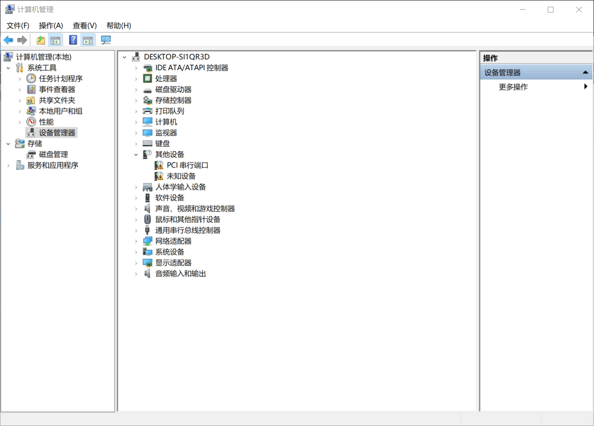

### 必备硬件

串口直连方式需要准备307USB模块：
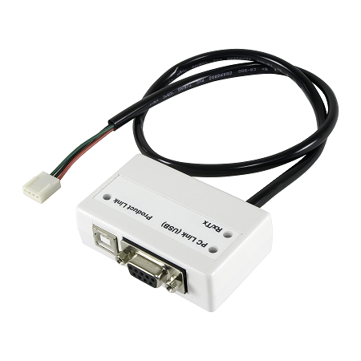

以太网方式需要准备网络模块：
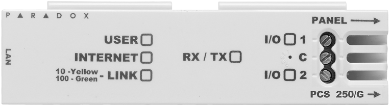

## 初始化

步骤一：启动Babyware，默认用户名是`Admin`,密码是`1234`。

步骤二：创建账户，选择主机型号，汉化软件，设置连接参数。


在创建账户后，请选择相应的主机型号，再连接或打开账户。


请参考下面演示动画：

设置连接方式，选择合适的方式建立连接。

- 串口方式，需要307USB通讯模块。307USB的USB端连接电脑，另一端连枫叶主机Serial端口，如图：
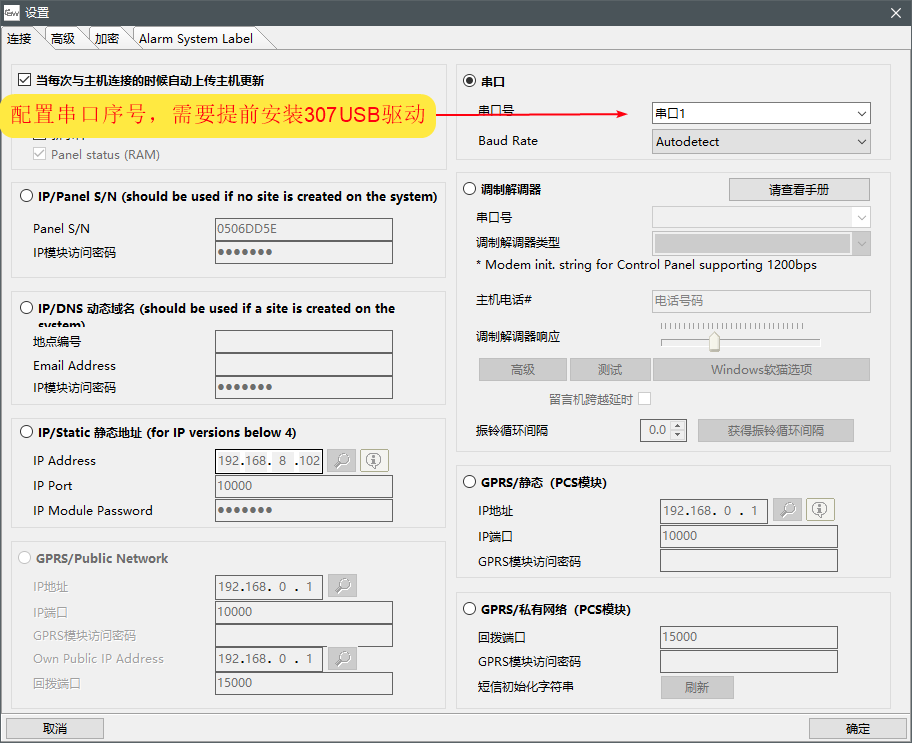
- IP方式，需要网络模块，将网络模块的Panel端和枫叶主机的Serial端口连接，插上网线。
  - IP/Panel S/N方式，需要网络模块，通过天鹅云方式连接，Panel S/N 填主机8位序列号，IP模块访问密码默认是`paradox`。如图：
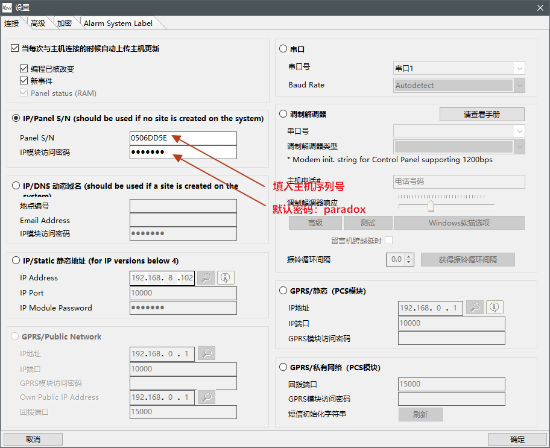
  - IP/Static静态地址，通过IP地址连接，填入IP地址和IP Port（默认：10001），IP Module Password默认是`paradox`。如图：
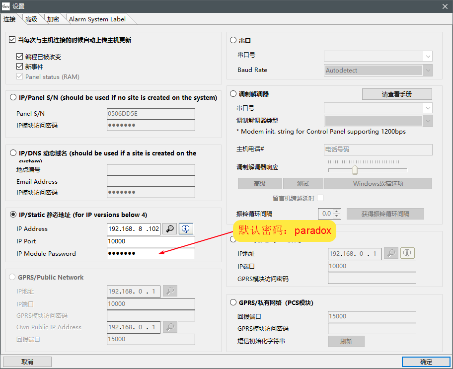


网络模块联网成功后，Internet指示灯是绿灯常亮状态，如果不亮或闪烁说明网络不通，请检查网络或相关设置。


## 软件操作说明

### 编程防区

防区分为有线防区和无线防区，其中有线防区分为板载防区和扩展防区，板载防区是主机板自带的防区，扩展防区是其他模块上的防区。下面演示一下编程方法：

**提示：防区类型的概念参考请点[防区类型说明](../../node1/important-knowledge/#防区（Zone）)。**

板载防区编程方法：
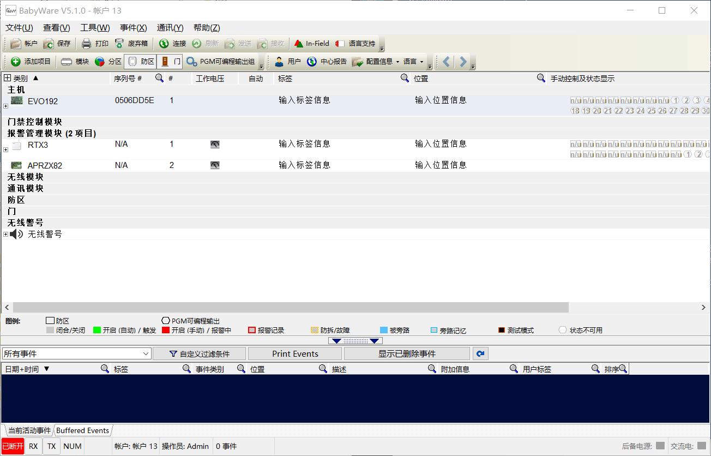

扩展防区编程方法：
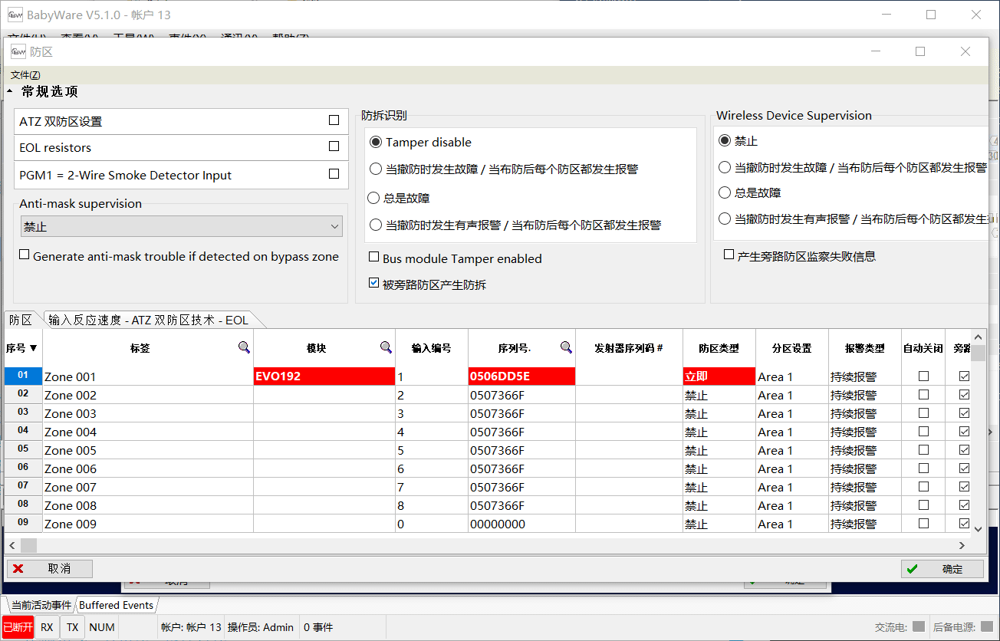

无线防区编程方法：
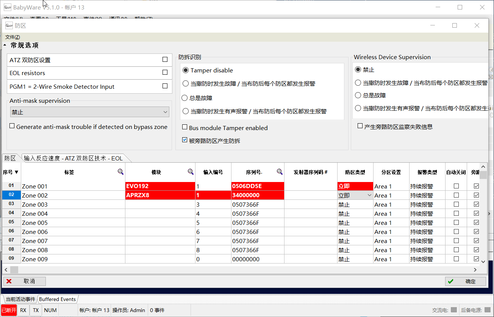

### 编程遥控器

请参考：
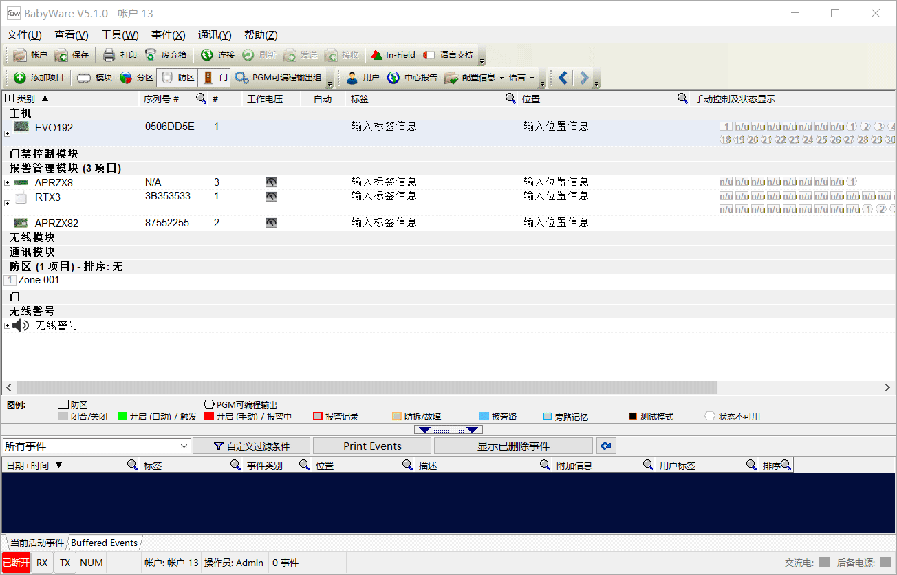

### 编程密码和权限

主机支持多用户，每个用户拥有单独的密码和权限，编程用户密码请参考：
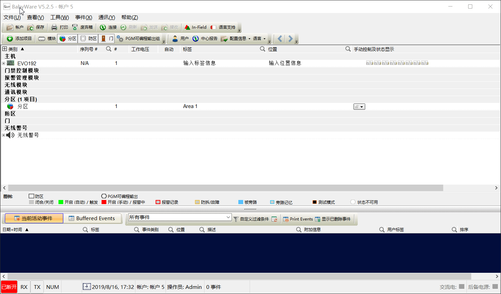

编程用户权限请参考：
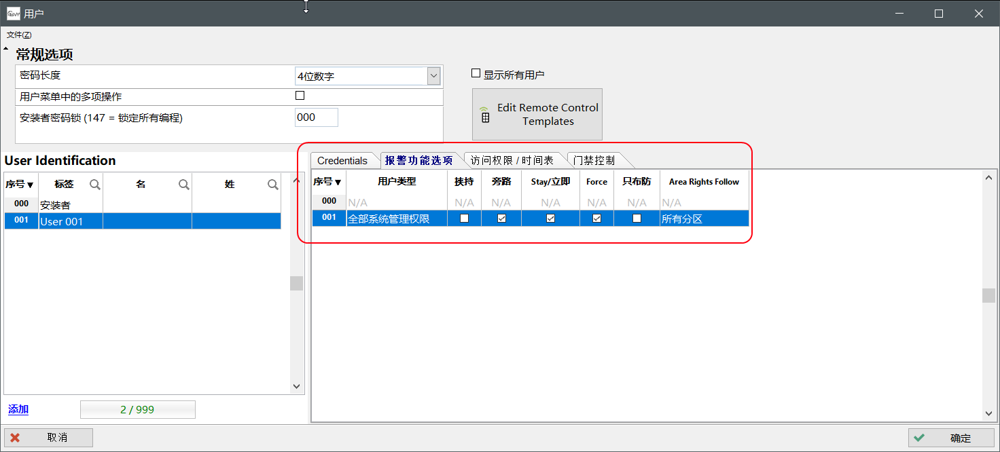

### 编程警号

下面是无线警号编程方法演示：

警号鸣笛时间设置请看下面演示：

### 编程退出延时


退出延时的概念请访问 → [退出延时概念](../../node1/important-knowledge/#退出延时)。


编程方法请参考下图：
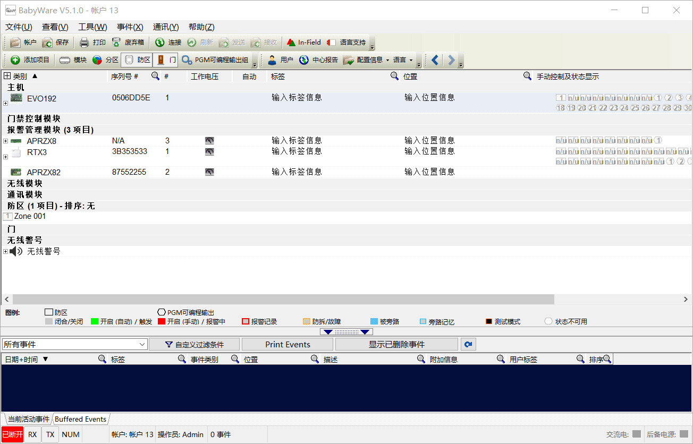

### 短信通知设置方法

需要设置3个参数，分别是手机号，分配所属分区和通知事件类型。也可以通过触摸屏键盘进入菜单 → 高级设置 → SMS短信设置。Babyware软件方式设置请参考动画：
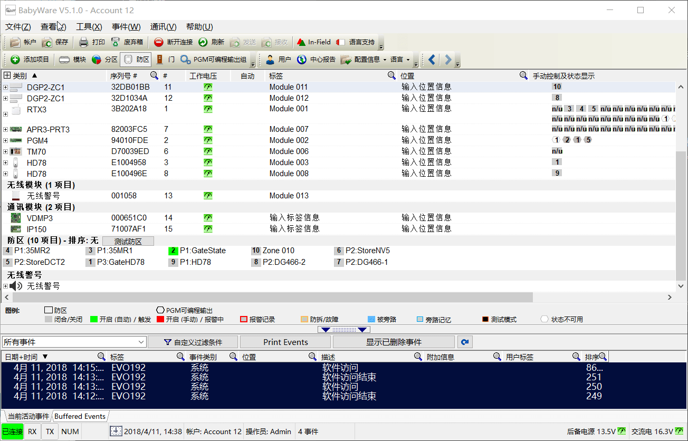

通过Babyware设置中文短信，如果失效的话，请用键盘进入高级编程设置，具体的方法如下：

- EVO主机-在触摸屏键盘上操作步骤：菜单 → 高级设置 → 安装设置 → 系统编程 → 安装者密码（默认：000000） → 输入`2953` → 输入`019`。
- SP/MG主机-在触摸屏键盘上操作步骤：菜单 → 高级设置 → 安装设置 → 系统编程 → 安装者密码（默认：0000） → 输入`856` → 输入`019`。

### 电话语音通知设置方法

请参考动画：
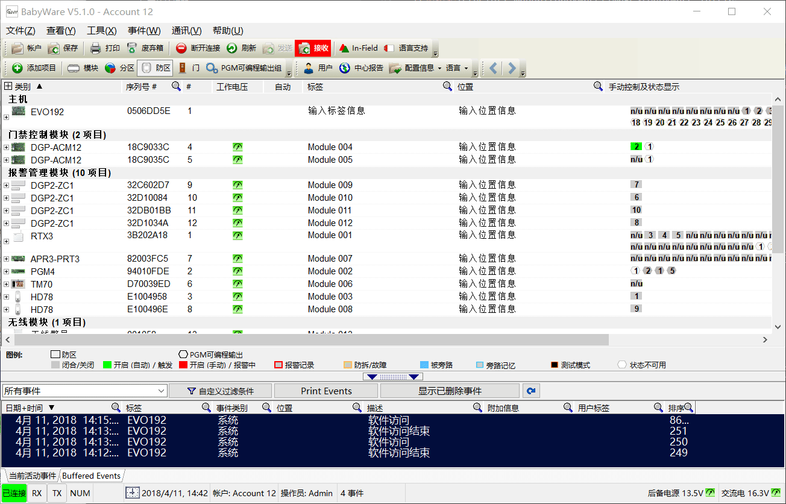

## 其他操作

### 查询无线防区信号强度方法

#### 针对EVO系列主机

说明：EVO主机所有的无线设备是通过无线收发模块RTX3来接入的，每一个RTX3最多可以接入32个无线探测器，在RTX3里面有32个段号来查询每一个防区的信号强度，即：601-632，例如需要查询RTX3里第1个无线探测器的信号强度，输入601即可，如果是第5个无线防区的信号强度，输入605即可。注意这里说的第一个无线防区，并不是防区001，而是此RTX3里定义的第一个防区，RTX3里的第一个防区可以通过编程设置为任何序号的防区，具体方法请参考上文中的防区编程。


目前只支持通过触摸屏操作键盘来查询。


下面演示查询RTX3的第一个探测器信号强度：

操作步骤：菜单 → 高级设置 → 安装设置 → 系统编程 → 安装者密码（默认：000000） → 输入`4003` → 输入RTX3八位序列号 → 输入`601` → 再去触发探测器，键盘上将会显示返回结果。`|<<<<<<<<<<|`这个表示信号是100%，即最强，如图：
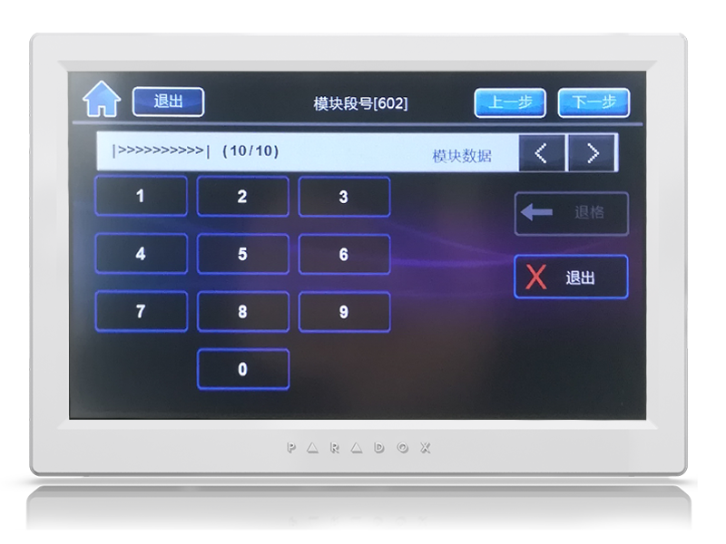

#### 针对SP系列和MG5000/MG5050主机

说明：SP和MG系列主机最多可以接入32个无线探测器，在RTX3里面有32个段号来查询每一个防区的信号强度，即：101-132，例如需要查询第防区1的信号强度，输入`101`即可，如果是防区5的信号强度，输入`105`即可。


目前只支持通过触摸屏操作键盘来查询


下面演示查询防区1信号强度：

操作步骤：菜单 → 系统设置  → 安装者密码（默认：0000） → 高级设置 → 安装者密码（默认：0000） → 系统编程 → 输入`101` → 针对MG系列主机可以直接去触发探测器，针对SP主机需要重启探测器或者触发防拆开关才能返回查询结果，比如：`|<<<<<<<<<<|`表示信号是100%，即最强。

#### 针对MG6250主机

MG6250的信号强度不能通过命令查询，可以在Babyware上直接查看。

### 查询无线探测器电池电量

提示：目前仅EVO系列主机支持此功能

说明：

1. EVO主机所有的无线探测器是通过无线收发模块RTX3来接入的，每一个RTX3最多可以接入32个无线探测器，在RTX3里面有32个段号来查询每一个探测器的电池剩余电量，即：701-732，例如需要查询RTX3里第1个无线探测器的电池电量，输入`701`即可，如果是第5个无线探测器的电池电量，输入`705`即可。注意这里说的第一个无线探测器，并不是防区001，而是此RTX3里定义的第一个防区，RTX3里的第一个探测器可以通过编程设置为任何序号的防区，具体方法请参考上文中的防区编程。
2. EVO主机还提供了32个段号用来查询当前电池已经使用过的时间，即：801-832，例如需要查询RTX3里第1个无线探测器的电池电量，输入`801`即可，如果是第5个无线探测器的电池电量，输入`805`即可。


目前只支持通过触摸屏操作键盘来查询。


下面演示查询RTX3的第一个探测器电池剩余电量：

操作步骤：菜单 → 高级设置 → 安装设置 → 系统编程 → 安装者密码（默认：000000） → 输入`4003` → 输入RTX3八位序列号 → 输入`701` → 再去触发探测器，键盘上将会显示一个数字，这个数字的单位是周，表示当前的电量还可以用多少周。

下面演示查询RTX3的第一个探测器的时间：

操作步骤：菜单 → 高级设置 → 安装设置 → 系统编程 → 安装者密码（默认：000000） → 输入`4003` → 输入RTX3八位序列号 → 输入`801` → 再去触发探测器，键盘上将会显示一个数字，这个数字的单位是周，表示当前的电池用了多少周。

### 打印事件

Babyware支持下载所有主机的日志，日志就是我们说的事件，这些日志对维护系统有很重要的作用，通过日志可以还原和找到系统出现异常的真实的原因。下面介绍步骤：

步骤1 下载日志，请看下面的动图演示:
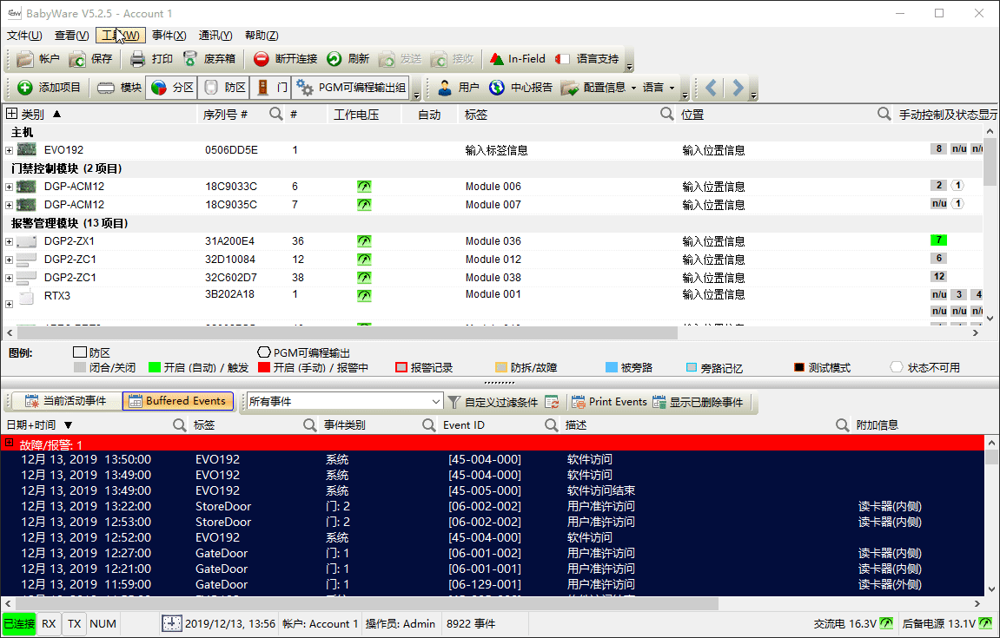

步骤二 分为3步:  
①：选择Buffered Events标签；  
②：请通过过滤器，选择想要查询或打印的的日志；  
③：执行打印。
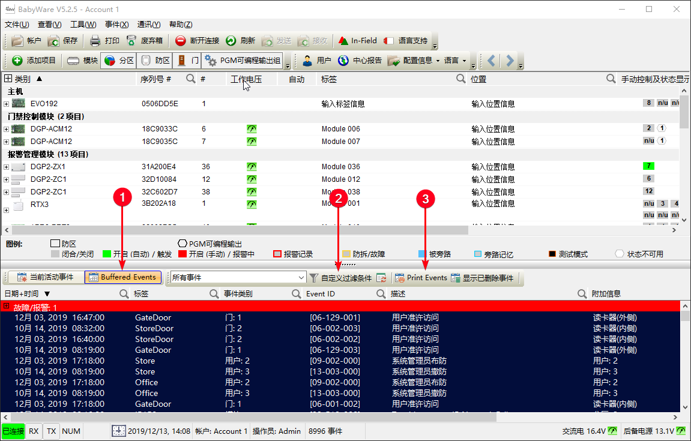

步骤三 执行打印，需要注意的是，在打印的时候选择合适的虚拟打印机，有时候选择不当会出现乱码，推荐使用 **Microsoft XPS Document Writer**，如图：
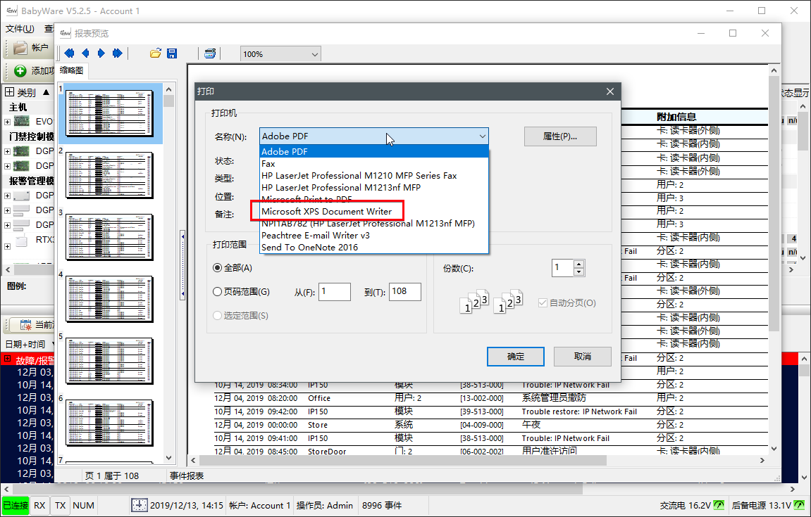

### 设置系统时间和日期

对于整个系统来说，需要记录所有发生的事件或者日志所发生的时间，就需要时钟功能，由于系统的时钟通常不能联网自动校准，时间长了会有误差，就需要人为校正。可以用个两个途径设置系统时间和日期：

途径一：通过Babyware，请看下面的动图演示:
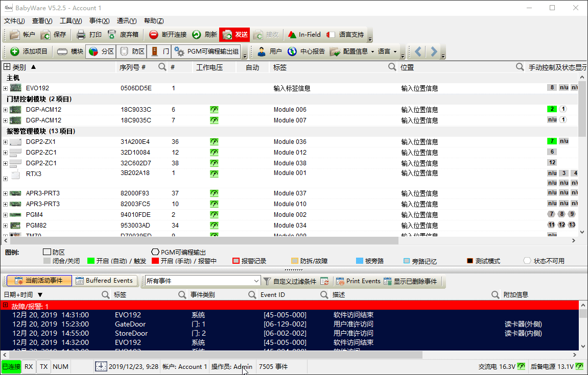

途径二：通过操作键盘:  

| 键盘 | 主机 | 操作步骤 |
|---|---|---|
| TM50/TM70 | SP/MG/EVO系列 | 操作步骤：菜单 → 系统设置 → 时间和日期 → 输入管理员密码（默认：`1234`）** 设置相应的时间和日期。|
| K636/K10V/K32+ | SP/MG系列 | 操作步骤：按 &#xE7E8  → 输入管理员密码（默认：`1234`） → 按TBL键 → 按5键 → 输入小时和分钟（格式：HH:MM，HH是小时，MM是分，例如：18：31分输入1831。）  → 设置时间格式，[1]表示24小时制，[2]表示上午，[3]表示下午 → 输入年月日`YYYY/MM/DD`，例如：2019年12月23日，输入`20191223`。** **注意：SP4000/SP65仅支持24小时制！|
| K656/K641+ | EVO系列 | 操作步骤：输入管理员密码 → 按TRBL键 → 按8键 → 输入小时和分钟 → 输入年月日 → 按Enter键 |
| MG6250 | MG系列 | 操作步骤：按menu键 → 选择`08-SYSTEM SETUP`，按ok键 → 输入管理员密码（默认：`1234`） → 选择`04-Time and Date` → 选择时间格式，12和24小时制 → 设置时间 → 设置年月日 → 按ok返回，设置相应的时间和日期。|

### 复位

有些误操作会导致内置程序错乱，出现一些奇怪的现象，可通过复位解决，其中复位分为软件复位和硬件，为了提高效率和便于操作，建议用硬件复位，下面介绍硬件复位方法：

|设备|复位方法|
|:------|:------|
|EVO192主机|将主机板上Reset和AUX两个按钮同时长按，直到指示灯全部熄灭即可|
|EVOHD主机|长按Reset按钮，直到指示灯快闪的时候松开再短按一下即可|
|SP5500 SP6000 SP7000 MG5000 MG5050 MG6250主机|长按Reset按钮，直到指示灯快闪的时候松开短按一下即可|
|MG6250主机|断开电源，同时长按\* | #按钮，然后上电，等系统启动后屏幕亮起，并且无任何显示的内容，此时松开按键，并按一下任意键，屏幕会出现`Factory Default`字符，表示是否要复位，按ok即可。|
|SP4000 SP65主机|断开电源，将PG1和Z1短接，然后上电，等待指示灯闪烁即可|
|网络模块IP100 IP150|长按Reset按钮，直到指示灯快闪的时候松开短按一下即可|
|总线模块：总线模块包括操作键盘、总线探测器、无线信号覆盖模块RTX3、对接模块PRT3，防区模块，继电器模块等|仅针对EVO系统，在触摸屏键盘上操作步骤：菜单 → 高级设置 → 安装设置 → 系统编程 → 安装者密码（默认：000000） → 输入`4001` → 输入模块序列号即可|

### 升降固件

固件是内置在设备中的程序文件，有些问题可能只适用于特定版本的固件。升降固件请看[刷固件工具(In-Field)使用说明](../../node2/infield/)，多数设备都可以通过连接主机进行升级，对于一些特殊的设备，升降级的时候需要直连设备，具体请咨询设备提供商。
