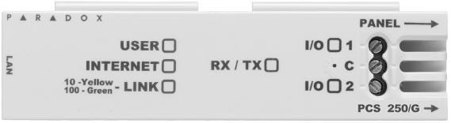
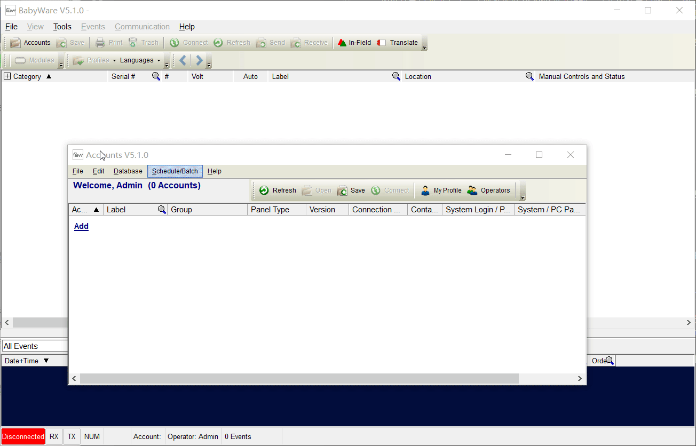

## 简介

枫叶为安装人员专门提供了一套工具软件Babyware，Babyware软件是用来设置、调试、售后维护枫叶安防系统的专用工具软件，非常直观，高效。支持汉语，支持枫叶全系列主机，支持串口、网络、拨号等通讯方式。

## 准备工作

### 安装软件

下载软件，下载Babyware请访问[资料服务器](http://support.senboll.com:8888/)。

### 安装驱动

如果是串口通讯方式，需要准备好307USB通讯模块，请先安装串口驱动。驱动下载请访问[资料服务器](http://support.senboll.com:8888/)。请根据Windows系统版本下载并安装驱动，如下图：

如果安装驱动遇到困难，请参考下面的步骤。

### 必备硬件

串口直连方式需要准备307USB模块：

以太网方式需要准备网络模块：

## 首次使用

步骤一：启动Babyware，默认用户名是`Admin`,密码是`1234`。

步骤二：创建账户，选择主机型号，汉化软件，设置连接参数，请参考下面演示动画：

设置连接方式，选择合适的方式建立连接。

- 串口方式，需要307USB通讯模块。
- IP/Panel S/N方式，需要网络模块，通过天鹅云方式连接，Panel S/N 填主机8位序列号，IP模块访问密码默认是`paradox`。
- IP/Static静态地址，通过IP地址连接，填入IP地址和IP Port（IP Port默认是10001），IP Module Password默认是`paradox`。

## 软件操作说明

### 编程防区

防区分为有线防区和无线防区，其中有线防区分为板载防区和扩展防区，板载防区是主机板自带的防区，扩展防区是其他模块上的防区。下面演示一下编程方法：

**提示：防区类型的概念参考请点[防区类型说明](../../node1/important-knowledge/#防区（Zone）)。**

板载防区编程方法：

扩展防区编程方法：

无线防区编程方法：

### 编程遥控器

请参考：

### 编程警号

下面是无线警号编程方法演示：

警号鸣笛时间设置请看下面演示：

### 编程退出延时

**提示：退出延时的概念参考请点[退出延时概念](../../node1/important-knowledge/#退出延时)。**

### 短信通知设置方法

需要设置3个参数，分别是手机号，分配所属分区和通知事件类型。也可以通过触摸屏键盘进入菜单 → 高级设置 → SMS短信设置。Babyware软件方式设置请参考动画：

通过Babyware设置中文短信，如果失效的话，请用键盘进入高级编程设置，具体的方法如下：

- EVO主机-在触摸屏键盘上操作步骤：菜单 → 高级设置 → 安装设置 → 系统编程 → 输入`000000` → 输入`2953` → 输入`019`。
- SP/MG主机-在触摸屏键盘上操作步骤：菜单 → 高级设置 → 安装设置 → 系统编程 → 输入`0000` → 输入`856` → 输入`019`。

### 电话语音通知设置方法

请参考动画：

## 其他操作

### 查询无线防区信号强度方法

#### 针对EVO系列主机

说明：EVO主机所有的无线设备是通过无线收发模块RTX3来接入的，每一个RTX3最多可以接入32个无线探测器，在RTX3里面有32个段号来查询每一个防区的信号强度，即：601-632，例如需要查询RTX3里第1个无线探测器的信号强度，输入601即可，如果是第5个无线防区的信号强度，输入605即可。注意这里说的第一个无线防区，并不是防区001，而是此RTX3里定义的第一个防区，RTX3里的第一个防区可以通过编程设置为任何序号的防区，具体方法请参考上文中的防区编程。

**注意：目前只支持通过触摸屏操作键盘来查询。**

下面演示查询RTX3的第一个探测器信号强度：

操作步骤：**菜单** → **高级设置** → **安装设置** → **系统编程** → 输入`000000` → 输入`4003` → 输入RTX3八位序列号 → 输入`601` → 再去触发探测器，键盘上将会显示返回结果。`|<<<<<<<<<<|`这个表示信号是100%，即最强，如图：

#### 针对SP系列和MG5000/MG5050主机

说明：SP和MG系列主机最多可以接入32个无线探测器，在RTX3里面有32个段号来查询每一个防区的信号强度，即：101-132，例如需要查询第防区1的信号强度，输入101即可，如果是防区5的信号强度，输入105即可。

**注意：目前只支持通过触摸屏操作键盘来查询。**

下面演示查询防区1信号强度：

操作步骤：**菜单** → **系统设置**  → 输入`0000` → **高级设置** → 输入`0000` → **系统编程** → 输入`101` → 针对MG系列主机可以直接去触发探测器，针对SP主机需要重启探测器或者触发防拆开关才能返回查询结果，比如：`|<<<<<<<<<<|`表示信号是100%，即最强。

#### 针对MG6250主机

MG6250的信号强度不能通过命令查询，可以在Babyware上直接查看。

### 查询无线探测器电池电量

提示：目前仅EVO系列主机支持此功能

说明：

1. EVO主机所有的无线探测器是通过无线收发模块RTX3来接入的，每一个RTX3最多可以接入32个无线探测器，在RTX3里面有32个段号来查询每一个探测器的电池剩余电量，即：701-732，例如需要查询RTX3里第1个无线探测器的电池电量，输入701即可，如果是第5个无线探测器的电池电量，输入705即可。注意这里说的第一个无线探测器，并不是防区001，而是此RTX3里定义的第一个防区，RTX3里的第一个探测器可以通过编程设置为任何序号的防区，具体方法请参考上文中的防区编程。
2. EVO主机还提供了32个段号用来查询当前电池已经使用过的时间，即：801-832，例如需要查询RTX3里第1个无线探测器的电池电量，输入801即可，如果是第5个无线探测器的电池电量，输入805即可。

**注意：目前只支持通过触摸屏操作键盘来查询。**

下面演示查询RTX3的第一个探测器电池剩余电量：

操作步骤：**菜单** → **高级设置** → **安装设置** → **系统编程** → 输入`000000` → 输入`4003` → 输入RTX3八位序列号 → 输入`701` → 再去触发探测器，键盘上将会显示一个数字，这个数字的单位是周，表示当前的电量还可以用多少周。

下面演示查询RTX3的第一个探测器电池已经使用过的时间：

操作步骤：**菜单** → **高级设置** → **安装设置** → **系统编程** → 输入`000000` → 输入`4003` → 输入RTX3八位序列号 → 输入`801` → 再去触发探测器，键盘上将会显示一个数字，这个数字的单位是周，表示当前的电池以及用了多少周。
