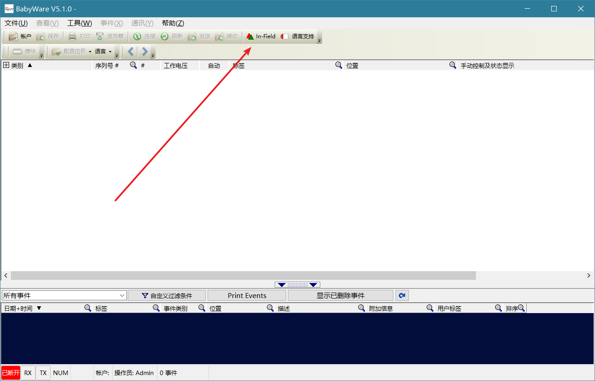
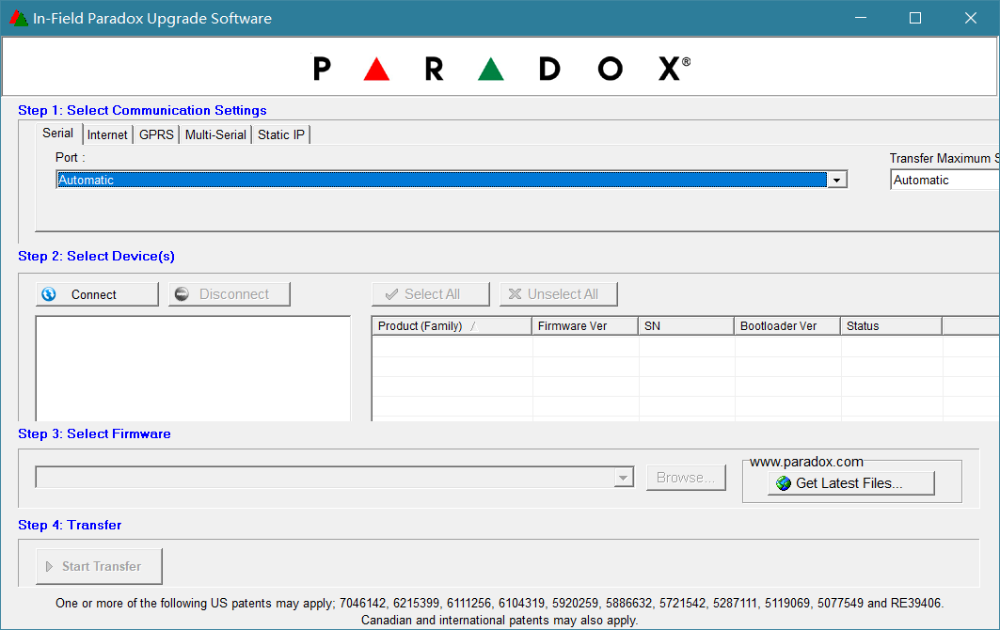
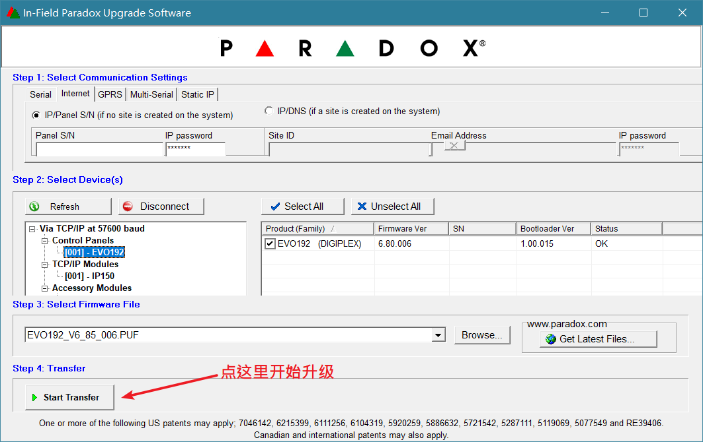

## 简介

Infield软件是专门用来刷枫叶设备固件的工具软件，支持串口，网络，拨号等通讯方式。

## 准备工作

由于Infield被集成到Babyware中，所以请先下载安装Babyware，具体步骤请访问[Babyware使用说明-安装软件](../babyware/#安装软件)。

## 操作说明

步骤一：启动Babyware，Infield启动入口如图：

步骤二：设置连接方式，选择合适的方式建立连接。请参考[Babyware使用说明-初始化](../babyware/#初始化)。

- Serial是串口方式，需要307USB通讯模块。
- Internet网络方式，需要网络模块，通过天鹅云方式连接，Panel S/N填入主机8位序列号，IP password默认是`paradox`。
- Static IP，通过IP地址连接，填入IP地址和端口号（端口默认是10001），IP password默认是`paradox`。

步骤三：选择需要升级的设备，准备好固件，开始升级。最新固件下载请访问[资料服务器](http://support.senboll.com:8888/)。升级的过程有时候比较慢，请耐心等待，切记不要中断通讯线路、关闭电脑或者Infield软件，否则有可能升级失败，甚至报废。如图：

