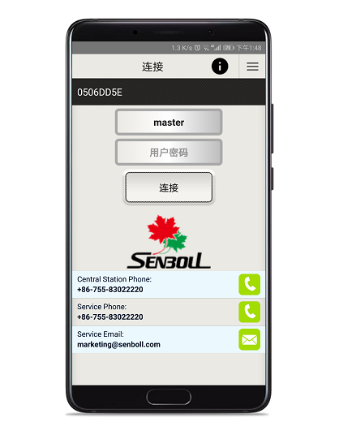
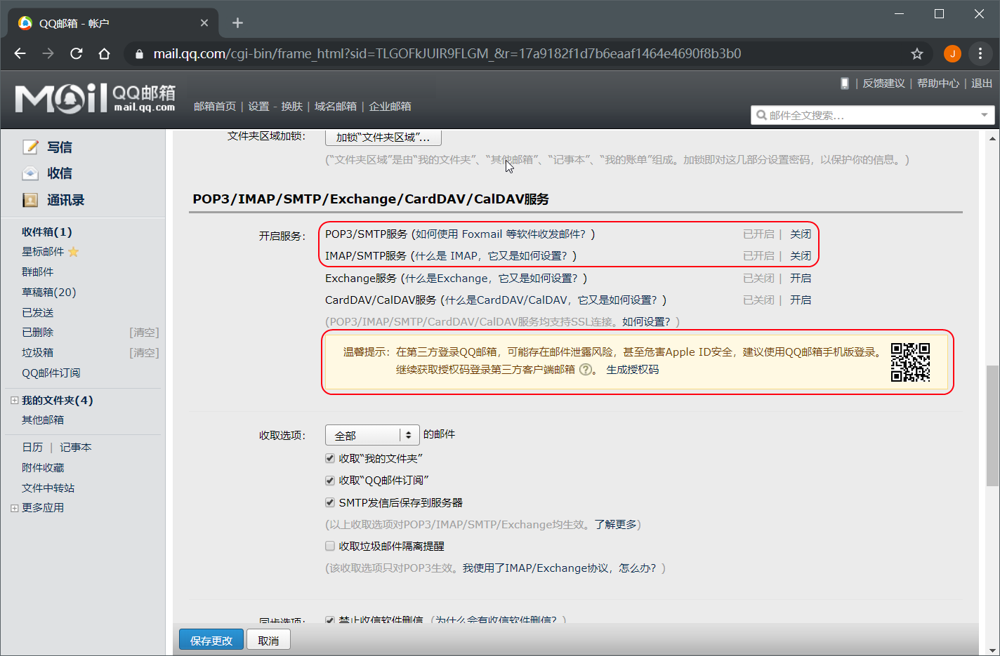

## 简介

Insite Gold是枫叶针对枫叶安防系统自主开发的手机应用app，集成了报警，视频复核，门禁控制和自动化控制功能，是报警系统、监控系统、门禁系统和智能家居控制的“一站式”解决方案。

## 版本日志

- 更新日期：20190611，版本：2.5.2，安卓请点[下载](attachment/InsiteGold-V2.5.2.apk)；
  - Migration of “Paradox my home” sites to new SWAN.
  - Fixed push notification language support (only on IP150 v4.40.011)
  - Bug and stability fixes.
  
- 更新日期：20190530，版本：2.5.1，安卓请点[下载](attachment/InsiteGold-V2.5.1.apk)；
  - Migration of “Paradox my home” sites to new SWAN.
  - Fixed push notification language support (only on IP150 v4.40.011)
  - Bug and stability fixes.

- 更新日期：20190522，版本：2.5.0，安卓请点[下载](attachment/InsiteGold-V2.5.0.apk)；
  - Migration of “Paradox my home” sites to new SWAN.
  - Panel language support.
  - New info button with option to share site details.
  - Hostname support on fixed IP mode.
  - Bug and stability fixes.
  
关于功能的详细描述请访问：[了解更多](http://aboutswan.paradox.com/version_insitegold)

## 准备工作

硬件：枫叶主机和网络模块IP150，并接入互联⽹（连接IP150的路由器需要开启DHCP）；

软件：手机上安装Insite Gold软件，IOS用户到商店搜索Insite Gold，

## 初始化设置

### 步骤一：确认主机状态，记录主机8位序列号

1. 确保IP150的软件版本在V4.0以上，Internet灯长亮，如下图：

    

2. 记录枫叶主机8位序列号。如下图：

### 步骤二：激活

请将主机的序列号提供给枫叶技术人员。

### 步骤三：启动APP

激活成功后，打开APP，点击APP的`+`加号按钮，添加账户。

**地点名称**是可选项，可以不填；

**地点编号**处填入8位主机序列号；

**SWAN邮箱**处填入`paradox-support@qq.com`。

如果没有HD77/HD78系列视频探测器，只有IP网络模块，只需要输入用户密码（默认用户密码是`1234`）即可登陆。

如果含有HD77/HD78等系列视频探测器，需要填帐户名和用户密码，默认最高权限帐户名是`master`，默认用户密码是`1234`。

## 邮件推送设置

由于安卓版本推送借助了谷歌服务，在国内无法使用谷歌服务，如果是安卓手机用户，我们建议采用邮件来推送消息，推荐使用qq邮箱。

qq邮箱有独立手机app，也可以通过qq或者微信添加推送服务来实现。下面介绍app和微信方式设置方法。

### qq邮箱app方式推送

qq邮箱app有个特别的功能，支持系统级推送（系统级推送是借助手机厂商内置服务来实现推送，比如华为手机服务，小米手机服务等，不需要启动app，只需手机开机且能上网便能接收推送），目前我们测试了华为，小米，魅族等手机，均可以实现系统级推送。

#### qq邮箱app推送方式

**设置邮箱：**

准备一个qq邮箱，登录[mail.qq.com](https://mail.qq.com)，设置步骤如下：

步骤一：点击设置，打开账户选项，如图：

步骤二：将qq邮箱的POP3/SMTP服务和IMAP/SMTP服务开启，然后生成授权码，将授权码记下来下面的步骤要用到。如图：

**设置网络模块：**

步骤一：确保计算机和网络模块在同一网段下，启动枫叶搜索工具，查询网络模块IP地址，双击搜到的模块会弹出网页登录界面，输入用户密码将会进入web设置界面，如图：

步骤二：切换的email设置界面，填入的信息如图所示：

### qq邮箱微信方式推送

## 缴费

两种方案：

1. 通过APP直接缴费，要求需要准备具备Visa标志的银行卡，请自行按照APP支付页面支付费用；
2. 代付，如果没有跨境⽀付渠道，[枫叶APP缴费](http://support.senboll.com:8888/swan)。
