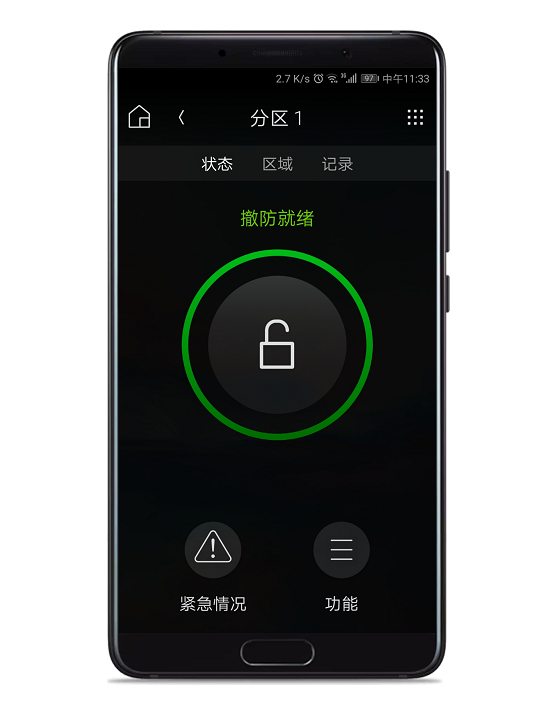
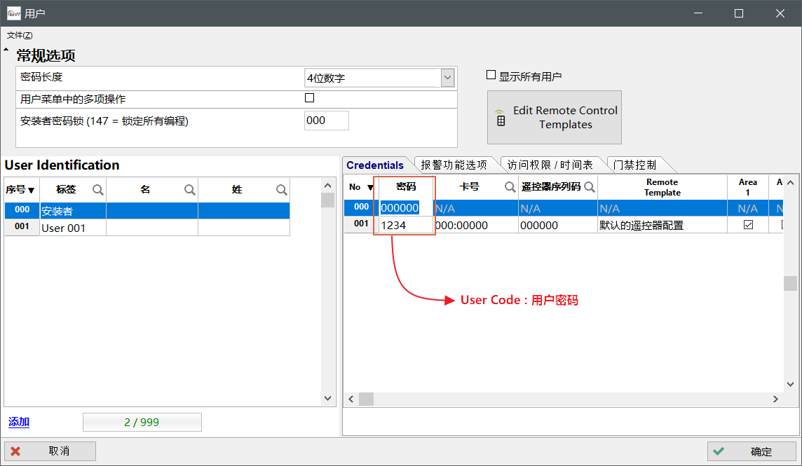

## 简介

为智能集成商提供的枫叶和Control4集成方案。

为了满足智能家居的个性化需求，整合各系统的资源，更加灵活、智能和人性化。我们提供[Control4](http://www.control4.com)集成解决方案。现在功能已经成熟稳定，随着产品和方案的演化会持续升级更新。感谢各位合作伙伴关注和支持。

## 功能

- 最大支持8个分区和192个防区；
- 通过Control4执行分区布/撤防、报警状态展示、取消报警等操作；
- 通过Control4一键紧急报警求救(110,120,119)；
- Control4可实时获取并展示防区开路、闭合或报警状态；
- 支持退出延时；
- 支持分区、防区标签自定义；
- 分区、防区状态自动和安防主机双向实时自动同步；
- 防区分配至所属分区；
- 分区状态(布防、撤防、报警和紧急报警)、防区状态、故障、门禁事件可用于联动；
- 通过Composer编程可对分区布/撤防、一键紧急报警；
- 通过驱动中的智能按钮联动安防主机的继电器，实现更加个性化的智能体验；
- 支持状态信息、故障信息和报警信息日志。

## 版本更新日志

- 更新时间：20160327
  - 发布第一个版本；
  - 新增：退出延时；
  - 新增：立即、强制和留守布防类型和撤防。
- 更新时间：20160827
  - 新增：3种紧急报警110，119，120功能；
  - 新增：防区状态文字提示；
  - Bug修复：钥匙开关自动撤防界面不同步撤防状态。
- 更新时间：20160914
  - 新增：安防系统中的用户刷卡输出不同的信号，可用于中控联动。
- 更新时间：20160919
  - 新增：驱动在初始化的时候，主动发起分区状态查询；
- 更新时间：20160921
  - 新增：192个防区状态实时显示功能；
  - 新增：单独实时输出防区状态信号，可以用来联动灯光等用途；
  - 新增：支持防区自动分配到相应的分区。
- 更新时间：20170415
  - 新增：最大支持8个分区和192个防区；
  - 新增：支持在Composer上自定义防区和分区中文标签；
  - Bug修复：分区显示消失问题；
  - 新增：为了提供更好的和有针对性的服务，增加注册码授权机制；
  - 新增：自动更新统分区，防区状态，保持状态实时同步到中控主机。
- 更新时间：20170418
  - 优化：提高串口并发处理数据的能力，增强稳定性；
  - Bug修复：重启中控主机后分区内的防区消失的问题；
- 更新时间：20170426
  - 优化：针对有些操作系统Composer上驱动属性的描述显示问题，修改驱动属性说明为ToolTip方式。
- 更新时间：20170818
  - 优化：去掉EntryDelay属性；
  - 优化：减少全局变量，提高运行效率；
  - 优化：自动同步状态功能和算法，提高可靠性；
  - 新增：增加防区报警后状态保持，直到撤防后恢复，此功能是APP无法查看报警记录的替代解决方案；
  - 新增：增加防区报警状态字段；
  - Bug修复：撤防或者取消报警时偶尔不弹出密码输入界面。
  - 新增：增加5个智能按钮，智能按钮对应安防主机里面的功能键，可以根据需要作为触发继电器的条件；
  - 新增：Composer中可以联动一键撤防主机。
- 更新时间：20170823
  - 新增：Composer中增加获取分配防区命令按钮；
  - 新增：Composer中增加全局变量命令按钮。
- 更新时间：20170907
  - Bug修复：Control4主机重启分区的防区列表为空；
  - Bug修复：防区被分配到多个分区(枫叶安防系统规定一个防区只能属于一个分区)；
  - 新增：驱动试用，试用时间延长到300分钟。
- 更新时间：20171016
  - 新增：新增智能按钮事件，当按钮被按下会以Event(事件)方式通知Control4，实现联动功能。
- 更新时间：20180314
  - 退出延时时间上限增加到255秒。
- 更新时间：20180503
  - 新增：门禁状态反馈事件：外出请求成功
  - 新增：门禁状态反馈事件：进入请求失败
  - 新增：门禁状态反馈事件：开门时间超时报警
  - 新增：门禁状态反馈事件：开门时间超时报警后恢复
  - 新增：门禁状态反馈事件：门被强制打开报警
  - 新增：门禁状态反馈事件：门被强制打开报警后恢复
  - 新增：门禁状态反馈事件：某个用户请求进入成功
  - 新增：门禁状态反馈事件：某个用户请求进入失败
- 更新时间：20180615
  - 新增：报警后防区状态是否保持驱动属性可选项。
- 更新时间：20180625
  - Bug修复：在退出延时未结束之前取消布防后分区状态依然显示正在布防。
- 更新时间：20181105
  - 优化：提升用户体验，解决Control4部分主机重启后，防区显示不全的问题。
- 更新时间：20181214
  - Bug修复：强制/留守/立即布防状态同步问题。
- 更新时间：20181227
  - 新增：增加医疗、应急和火灾事件，可用于联动场景。
- 更新时间：20190102
  - 优化：驱动图标（更换为枫叶触摸屏键盘）。
  - 新增：增加电话线故障和恢复事件。
  - 新增：增加交流电故障和恢复事件。
  - 新增：增加AUX输出过载故障和恢复事件。
  - 新增：增加警号输出过载故障和恢复事件。
  - 新增：增加警号未接故障和恢复事件。
  - 新增：增加时钟丢失故障和恢复事件。
- 更新时间：20190603
  - 变更：用于驱动Key属性。
  - 变更：驱动在线帮助链接地址。
- 更新时间：20190625
  - 新增：增加布撤防失败的提示。
  - 优化：去掉布防模式前缀。
  - 汉化：刷新功能按钮。
- 更新时间：20190701
  - 优化：退出延时完毕后查询分区状态。
  - 优化：优化定时器的用法，增加驱动稳定性。
- 更新时间：20190710
  - 新增：自动升级驱动。
  - 新增：手动一键升级驱动。
- 更新时间：20191231
  - 变更：驱动属性`Auto Get Panel Status Interval`变为`Polling Period`，属性参数默认值改为5分钟。

## 准备工作

### 具备的软硬件

- Control4：
  - Control4主机(带双向通信串口)；
  - 编程软件Composer；
- 枫叶：
  - 编程软件Babyware，关于软件的使用说明请访问[Babyware使用说明](../babyware/)，如果是通过307USB编程安防主机请下载307USB驱动；
  - 编程模块，串口307USB模块或网口IP150模块（选择一个即可）；
  - 安防主机(EVO192/EVOHD)；
  - 对接专用PRT3模块；
- 其他：
  - 枫叶驱动；
  - 串口线，用来连接对接模块和中控主机，有些Control4中控主机带9针串口输出用RS232标准直连串口线连接即可，有些Control4主机串口是3.5mm输出，需要3.5转RS232，如果是自制的线，线序请参考；    
    **3.5mm转DB9：**
    
    **标准直连串口线：**
    

注：枫叶软件下载，请访问 -> [资料服务器](http://support.senboll.com:8888)，登陆用户名和密码请[微信联系](../../contact.html)获取；

### 步骤一：下载驱动和授权




**授权：**

1. 在Composer中加载枫叶驱动；
2. 驱动授权，请访问 -> [驱动授权](http://support.senboll.com:8888/codepay)，请按页面提示输入真实的信息，提交会生成微信支付二维码，支付成功后，服务器自动发送授权码将到提交的邮箱。

驱动授权成功后：

### 步骤二：安防系统的接线和设置PRT3


PRT3模块和安防主机是采用枫叶总线方式通信，枫叶总线的通信距离可以延伸至900米，如果安防主机和中控主机距离比较远，请将PRT3模块置于中控主机处，千万不要延长串口线来解决，因为串口通信标准的理论最大距离是15米，通常不可超过9米，否则会不稳定，并且距离跟波特率有关系。


请完成安防系统的接线和上电，并且掌握基本操作和设置，具体请咨询设备提供商。


设置PRT3可以通过枫叶操作键盘和Babyware软件，推荐用操作键盘，因为有时候Babyware设置会不起作用，这是小概率。



设置完毕后请重启枫叶主机和模块生效。


方法一：通过键盘设置，在触摸屏键盘上操作步骤：**菜单** → **高级设置** → **安装设置** → **系统编程** → 输入`000000` → 输入`4003` → 输入PRT3八位序列号 → 输入`016` → 将1,2,4选项打开，效果如图：

方法二：通过软件Babyware设置，请参考下图所示的内容设置，其中图1是中文界面，图2是英文界面。
  
  

### 步骤三：连接中控和安防系统

- 用串口线将PRT3和Control4主机连接起来；
- 在Composer上做串口连接，注意硬件串口和Composer上的串口要对应，如果前面的步骤都没有问题，驱动会自动获取安防系统的状态；
- 如果前面的步骤还未完成，请在一切准备好后，按照下面的方法尝试建立连接；
  

**连接成功：**

如果建立了连接，可以通过Conotrol4来控制安防系统，安防系统的状态也会实时反馈，连接成功后Conotrol4的界面应该是这样：

同时也可以通过Composer来直接控制安防系统，演示如下：

**未连接：**

会出现这种情况：

常见原因有3种：

1. 硬件连接问题，接口未插好，或串口线质量问题，但最常见原因是串口线的线序问题；
2. 驱动的设置问题，加载好驱动后，在Composer上需要将驱动和串口建立连接，
3. PRT3的参数没有设置成功，建议请用键盘设置。

### 步骤四：初始化驱动属性

关于用户、分区、防区、退出延时的定义和一些安防基础知识请访问[基础知识](../../node1/important-knowledge/)，本站仅提供的一些参考，更详细的请咨询设备提供商，最好请设备提供商做个培训指导。

请先完成安防系统的设置，再根据安防系统的设置内容来设置驱动属性，驱动属性中有几个比较重要属性需要设置，下面是属性的说明：

- **User Code** ，默认是`1234`，因Control4目前不支持多用户，所以此处填入安防系统里的某一个用户密码（有布撤防权限），通常填入管理员密码即可。Babyware中设置：

- **Number of Partitions**，默认是`1`，分区数量就是开启了多少个分区。分区数量太多会让用户感觉繁琐复杂，管理起来容易混乱，通常我们建议最多开启2个分区，室外一个区，室内一个区是最典型的应用。Babyware中设置：

- **Number of Zones**，默认是`1`，防区数量就是开启了多少个防区，Babyware中设置：

- **Exit Delay**，默认是`60秒`，请将安防系统的每一个分区退出延时设置为相同的时间，因Control4目前不支持对某一分区单独设置退出延时时间，Babyware中设置：

- **Keep Open When Zone Alarm**，表示当防区报警，状态是否需要保持直到系统撤防，根据实际需要设置。

- **Polling Period**，同步安防主机状态周期，单位是分钟，默认5分钟同步一次。

### 步骤五：分配防区

在操作前，请确保枫叶和Control4连接成功。
请用Babyware编程防区编程完防区，然后对防区的标签单独设置，规则是：需要在标签加前缀`PX`:，其中P是Partition分区的第一个字母，字母请大写，X表示分区号，如果是1分区就是`P1`，2分区是`P2`，前缀后面的内容可以自定义，只支持数字和字母。例如：

然后在Composer中执行分配防区命令：

## 功能设置

### 编辑分区和防区标签

**分区标签**
整个过程和效果参考下图：

**防区标签**
整个过程和效果参考下图：

### 编程联动功能

本驱动提供了安防系统的分区状态，防区状态，门禁，故障和智能按钮等事件的联动功能，通过这个功能，可以实现一些高级功能，实现场景的智能联动。

#### 分区联动

驱动支持8个分区，每一个分区提供了9个事件，都可用于联动，下面是事件的说明：

|事件名称|描述|
|:-:|:--|
|Alarm|发生报警|
|Alarm Clear|取消报警|
|Disarmed|分区已撤防|
|Armed|分区已布防|
|Partition State Changed|分区状态发生变化|
|Arm Failed|布防分区失败|
|Disarmed|撤防分区失败|
|Emergency Triggered|分区发生紧急报警|
|Arm Status|分区布防状态发生变化|

编程界面如下：

#### 防区联动

下面以防区状态为例来演示具体的联动编程步骤，EVO主机，最多可以支持192个防区，所有防区信号都会通过驱动发送到中控。在驱动初始化完毕，默认的防区数量是1，根据主机实际的防区数量，修改驱动防区数量属性即可。要实现这个功能，需要2步：

第一步：创建Contact Switch，数量取决于要联动的探测器数量，以3个防区为例，进入Composer -> Connections，拖动Control Outputs下的防区和Contact Switch建立连接；

第二步：进入Composer -> Programming，假设当防区1开路使继电器Relay输出开路Open信号；

下面是一个例子，演示如何设置2个防区和一个继电器的联动，实现当防区1开路，继电器输出开路信号，当防区1闭合，继电器输出闭合信号；防区2开路，继电器切换输出状态。演示如下：

#### 其他联动

以下是门禁、故障和智能按钮事件描述，请参考：

|事件名称|描述|
|:------|:------|
|Request For Exit Door1|外出请求成功 - 1号门|
|Request For Exit Door2|外出请求成功 - 2号门|
|Access Denied Door1|进入请求失败 - 1号门|
|Access Denied Door2|进入请求失败 - 2号门|
|Door Left Open Alarm Door1|开门时间超时报警 - 1号门|
|Door Left Open Alarm Door2|开门时间超时报警 - 2号门|
|Door Left Open Restore Door1|开门时间超时报警后恢复 - 1号门|
|Door Left Open Restore Door2|开门时间超时报警后恢复 - 2号门|
|Door Forced Alarm Door1|门被强制打开报警 - 1号门|
|Door Forced Alarm Door2|门被强制打开报警 - 2号门|
|Door Forced Open Restore Door1|门被强制打开报警后恢复 - 1号门|
|Door Forced Open Restore Door2|门被强制打开报警后恢复 - 2号门|
|Access Granted To User001|用户 001 请求进入成功|
|Access Denied To User001|用户 001 请求进入失败|
|Access Granted To User002|用户 002 请求进入成功|
|Access Denied To User002|用户 002 请求进入失败|
|Access Granted To User003|用户 003 请求进入成功|
|Access Denied To User003|用户 003 请求进入失败|
|Access Granted To User004|用户 004 请求进入成功|
|Access Denied To User004|用户 004 请求进入失败|
|Access Granted To User005|用户 005 请求进入成功|
|Access Denied To User005|用户 005 请求进入失败|
|Trouble - TLM|电话线故障|
|Trouble Restore - TLM|电话线故障恢复|
|Trouble - Auxiliary Current Failure|交流电故障|
|Trouble Restore - Auxiliary Current Failure|交流电故障恢复|
|Trouble - Battery Failure|蓄电池故障
|Trouble Restore - Battery Failure|蓄电池故障恢复|
|Trouble - Auxiliary Current Limit|AUX输出过载故障|
|Trouble Restore - Auxiliary Current Limit|AUX输出过载故障恢复|
|Trouble - Bell Current Limit|警号输出过载故障|
|Trouble Restore - Bell Current Limit|警号输出过载故障恢复|
|Trouble - Bell Absent|警号未接故障|
|Trouble Restore - Bell Absent|警号未接故障恢复|
|Trouble - Clock|时钟丢失故障|
|Trouble Restore - Clock|时钟丢失故障恢复|
|Utility Key1 is pressed|智能按钮 1 被按下的时候|
|Utility Key2 is pressed|智能按钮 2 被按下的时候|
|Utility Key3 is pressed|智能按钮 3 被按下的时候|
|Utility Key4 is pressed|智能按钮 4 被按下的时候|
|Utility Key5 is pressed|智能按钮 5 被按下的时候|

编程界面如下：

### 编程智能按钮

智能按钮是安防系统中的多功能键(Utility Key)，可以作为触发安防系统继电器(PGM)的条件，继电器可以实现控制的设备很多，意味着这个按钮可以控制安防系统继电器，一种常见的用法是控制门禁功能。

在驱动初始化完毕，Composer上会出现5个智能按钮，默认情况下APP界面不显示，需要在Room上打开导航栏，将其设置为可见，如图：

在Babyware上继电器(PGM)编程界面上根据需要编程激活事件和恢复事件，编程方法如图：

### 编程一键紧急求助

枫叶驱动界面提供了3种紧急求助一键按钮，分别是火灾，救护，应急，分别对应国内的119，120，110。

此功能需要在Babyware上设置才能生效，设置内容如图：

### 启用日志功能

通过这个功能，可以记录3类日志，报警日志，故障，状态信息日志，启动方法和效果如下：

## 常见问题

### C4只显示1个分区，其余分区无法显示

Control4低于3.0系统不需要设置此步，3.0以上默认只显示一个分区，需要在Composer设置才能显示其他分区，设置步骤如下：

### C4主机重启后安防离线

由于驱动无法得知C4是否重启，所以不能及时同步状态。为了解决这个问题，请配置驱动属性**Polling Period**（自动同步周期），默认是5分钟同步一次，这个时间不是越短越好，为了系统稳定建议设置5分钟。

### 键盘上显示分区锁定

访问 → [常见问题-硬件问题-键盘显示分区锁定](../../node3/hardware/#键盘上显示分区锁定)

### 通过Control4无法布防

**Control4无任何提示**  
请在枫叶操作键盘上尝试是否能成功布防，如果不行，问题在安防系统这边，请仔细检查接线和设置，一步步盘查问题。如果枫叶操作键盘可以布防，Control4不能布防，请首先检查接线和设置。

**Control4提示失败**  
可能是分区锁定（如果在5分钟之内输入密码错误5次会导致分区锁定），或者密码错误，属密码错误最常见。例如：

如果偶尔不能布防，首先请确认**强制布防**模式会不会出现这种情况，如果不会，只有**常规布防**，**留守布防**，**立即布防**会有时候出现布防不了，这是由于有防区未准备好，除了**强制布防**会忽略防区状态是否准备好，其余的布防模式都要求防区准备好才能进行布防动作，关于布防方式的详细描述请看[这里](../../node1/important-knowledge/#布防模式)。

### 通过Control4无法撤防

**Control4提示失败**
可能是分区锁定（如果在5分钟之内输入密码错误5次会导致分区锁定），或者密码错误，属密码错误最常见。例如：

### 疑难杂症

如果碰到了一些奇怪的问题，通过常见方法都解决不了，请尝试[疑难问题通用解决方法](../../node3/hardware/#万能大法)

## 联系方式

请务必先仔细阅读此文档，还有疑问，请[微信联系](../../contact.html)寻求更多帮助；