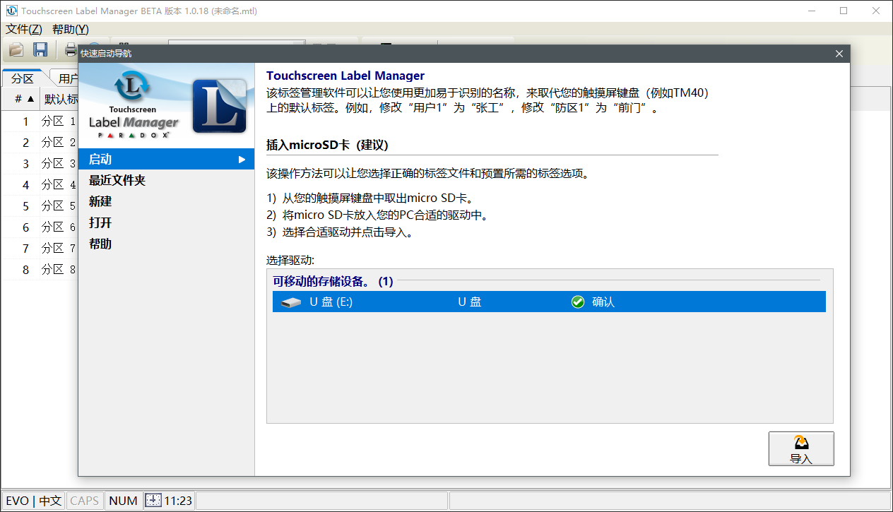
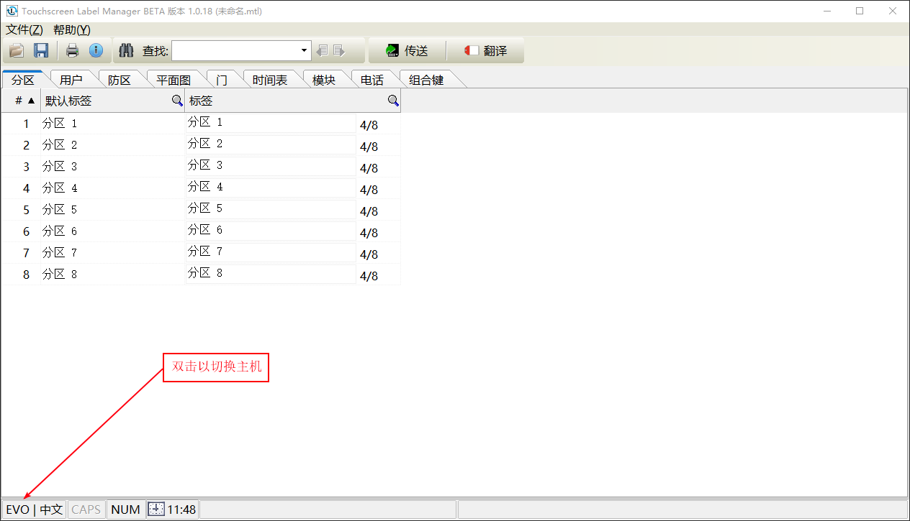
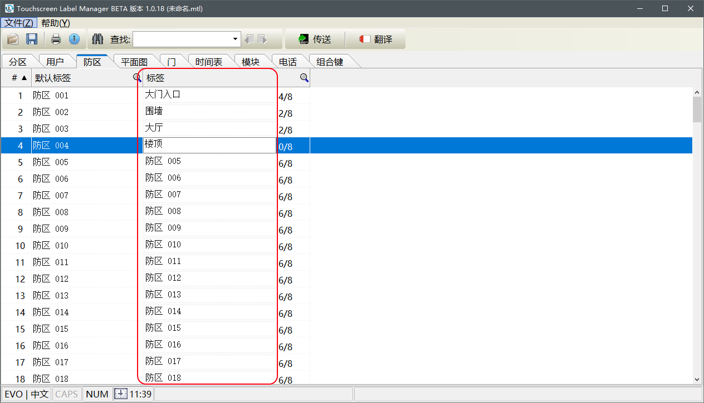
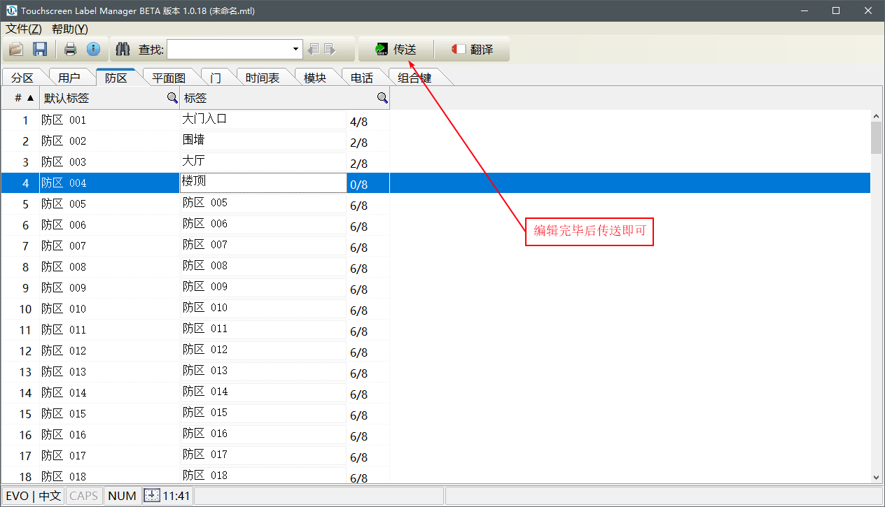
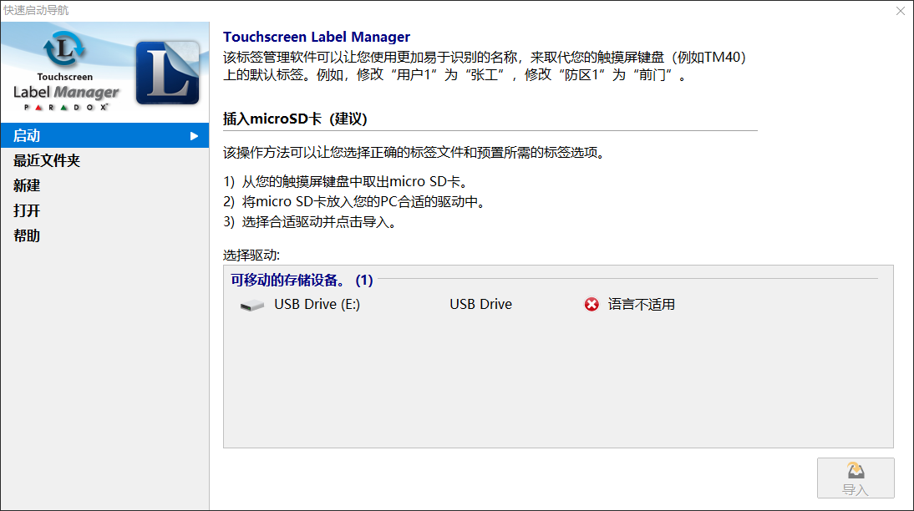

## 简介

触摸屏操作键盘提供多国语言，借助触摸键盘标签工具可以对其中的标签（如：防区标签、分区标签、用户标签等）自定义，本文介绍工具的使用方法。

## 视频教程

视频介绍较简单，仅供参考，请以文档为准。
{}

<!-- {} -->

## 操作步骤

### 安装软件

工具软件下载，请根据实际选择下载使用：

- TM50请访问 → [TM50键盘标签管理软件](https://senboll.com/zh-hans/product-detail/462)
- TM70请访问 → [TM70键盘标签管理软件](https://senboll.com/zh-hans/product-detail/471)

### 更新或替换内存卡初始文件

内存卡初始文件下载，请根据实际选择下载使用：

- TM50请访问 → [TM50键盘内存卡初始文件](https://senboll.com/zh-hans/product-detail/46)
- TM70请访问 → [TM70键盘内存卡初始文件](https://senboll.com/zh-hans/product-detail/47)

找到对应的触摸屏操作键盘在**其他文件**下载。根据操作键盘型号找相应的内存卡文件，拷贝文件到内存卡根目录。请参考下面TM50的内存卡的文件，如图：

### 编辑标签

请将触摸屏操作键盘的内存卡插入电脑，读卡成功后如下图，然后点击导入。

选择主机，按实际选择相应的系列主机：

可以对分区，防区，用户，平面图，门等常用标签自定义，如图：


**默认标签**不能修改，只可以自定义**标签**。


编辑完成点击传送，如图：

## 其他问题

- 如果电脑无法读内存卡，有可能是读卡器的问题或者损坏请更换再尝试。
- 内存卡的文件不能空白或者损坏，存储的文件是键盘默认的文件，如果文件损坏或者丢失，请参考 → [更新或替换内存卡初始文件](#更新或替换内存卡初始文件)。

### 内存卡编程文件丢失

错误如图：

有两个原因：

1. 刚出厂键盘还**未上过电**，需要上电初始化后，才可以使用标签管理工具读取写内存卡，所以请先给键盘上电再读内存卡。
2. 卡内的文件有问题，更新和替换内存卡初始化文件请参考 → [更新或替换内存卡初始文件)](#更新或替换内存卡初始文件)，根据操作键盘型号找相应的内存卡文件，**切记请先格式化内存卡**，再拷贝文件到内存卡根目录。

### 内存卡语言不适用

当键盘语言是非中文的时候，会出现这个错误，如图：

请把内存卡插回键盘，在键盘上切换到中文（方法参考 → [无法显示中文](../../node4/hardware/#无法显示中文)）。
