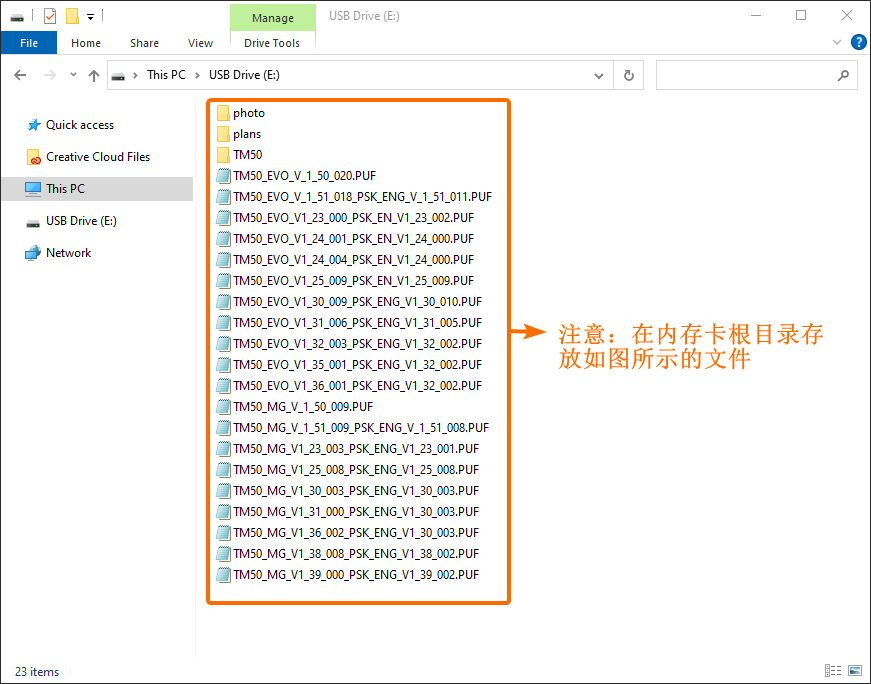

## 简介

触摸屏操作键盘提供多国语言，借助触摸键盘标签工具可以对其中的标签（如：防区标签、分区标签、用户标签等）自定义，本文介绍工具的使用方法。

## 视频教程

视频介绍较简单，仅供参考，请以文档为准。

{}

## 操作步骤

- 步骤一：安装软件

工具软件下载请访问 → [标签工具](attachment/touchscreen-lable.exe)，下载后直接采用默认提示安装即可。

- 步骤二：请将触摸屏操作键盘的SD卡插入电脑，读卡成功后如下图，然后点击导入。


2. 如果电脑无法读SD卡，有可能是读卡器的问题或者损坏请更换再尝试。
1. SD卡的文件不能空白或者损坏，存储的文件是键盘默认的文件，如果文件损坏或者丢失，下载请访问 → [资料服务器](http://support.senboll.com:8888/)。根据操作键盘型号找相应的SD卡文件，拷贝文件到SD卡根目录，下面是TM50的文件路径，如图：



- 步骤三：选择主机，更具实际选择相应的系列主机：

- 步骤四：编辑标签，可以对分区，防区，用户，平面图，门等常用标签自定义，如图：


**默认标签**不能修改，只可以自定义**标签**。


- 步骤五：编辑完成点击传送：
