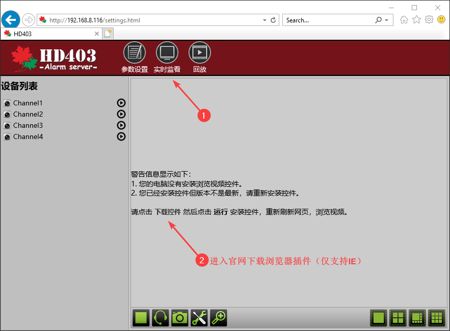

## 简介

实现将文本消息和视频消息推送至用户手机微信端的一款安防消息推送方案。微信在国内可以说是必装的手机应用，消息推送的稳定性、时效性有保障，我们正是基于此推出了微信端解决方案。至少有2个优势：

1. 应用越多手机越慢大家都知道，这种方案避免手机安装过多的应用程序。
2. 经过测试微信推送的时效性目前来说是最靠谱的，胜过系统级推送，这对于安防报警需求来说很重要。

## 功能

- 支持4路（最大1080P）高清IPC接入，支持三码流
- 4路高清IPC接入
- 支持1080P/720P/WD1/4CIF/DCIF/2CIF/CIF/QCI分辨率录像
- 1个板载有线防区，1路继电器输出
- 支持报警联动视频复核
- 支持视频移动侦测、视频遮挡、视频丢失，支持30s（2M码流，全帧率）延时预览，延时时间可配置
- 支持通过网络、3G/4G传输报警、视频数据
- 支持APP（报警推送、视频预览、视频回放、远程布撤防、消警、防区编程等功能）
- 支持2000条报警时间记录、500条操作事件记录，500条用户管理操作记录，支持原创搜索
- 查询事件日志
- 支持独立的以太网接警中心，支持2组独立的3G/4G接警中心
- 支持定时布撤防（日常计划、优先计划）
- 支持主机防拆报警，支持探测器防拆报警
- 支持1路串口
- 支持TF卡本地录像存储
- 支持微信平台，事件及报警视频推送

## 准备工作

请提对安防系统的设备（例如，探测器，警号，蓄电池，操作键盘）接线并编程防区，分区，用户等内容。

### 硬件

枫叶主机和微信模块，并接入互联⽹（连接微信模块的路由器需要开启DHCP选项）。

### 软件

- 一台windows电脑，推荐win10操作系统。
- 下载搜索工具 → [搜索工具下载](https://www.senboll.com/zh-hans/product-detail/484) → 找到**其他文件**点击**搜索工具**即可下载。
- 下载IE浏览器插件（预览视频的时候需要） → [IE浏览器插件下载](https://www.senboll.com/zh-hans/product-detail/484) → 找到**其他文件**点击**IE浏览器插件**即可下载。

## 安装

### 步骤一：连线和上电

用微信模块包装盒的四芯线将微信模块的Panel口和安防主机Serial口连接，保证网络畅通，插网线至微信模块Wan口，然后给整个系统上电。

### 步骤二：进入web设置页面

打开搜索模块，搜索微信模块。请保证电脑和微信模块在同一个局域网。如图：  

搜索到模块之后，双击搜索结果会自动打开浏览器，进入登陆界面，默认用户名和密码是`admin`。

### 步骤三：安装IE浏览器插件

进入实时监看页面，下载IE浏览器插件并安装，如图：  

安装完浏览器插件，重新启动IE浏览器，进入实时监看，将会弹出插件是否启用的提示，直接启用即可。  

### 步骤四：开通微信端

请使用手机微信扫描以下二维码，并关注公众号，如图：  

1. 添加主机

点击**账户管理** → **账号管理** → **添加主机**，扫描微信模块外壳上的二维码，并完善一些信息和选择需要的推送事件，如图：

2. 开通试用期

回到公众号首页点击**账户管理** → **充值缴费**，在弹出的新页面点击续费，如图：

接下来的页面中选择**试用一个月**，点击**确认支付**，如图：

### 步骤五：微信端一些设置

#### 设置防区，分区，用户，门，通道等

回到公众号首页点击**账户管理** → **账户管理**，在弹出的页面按住已添加的主机左滑，将打开更多配置选项，如图：

打开资源设置页面，对主机的一些资源设置，包含防区，分区，用户，门，视频通道的标签等，如图：

#### 添加其他用户

1. 生成新用户二维码

新用户需要提前关注此公众号，并在公众号首页点击**账户管理** → **账户管理**，在弹出的页面下面点**成为成员**，将会生成二维码，如图：

2. 管理员回到公众号首页点击**账户管理** → **账户管理**，在弹出的页面按住已添加的主机左滑，将打开更多配置选项，选择**成员**选项，在打开添加成员的设置页面点**添加成员**，然后扫描上一步新用户的二维码，同时对其资料和权限做一些设置。如图：

## 通用设置

### 缴费

回到公众号首页点击**账户管理** → **充值缴费**，在弹出的新页面点击续费，如图：

接下来的页面中选择**一年/或三年**，点击**确认支付**，如图：
