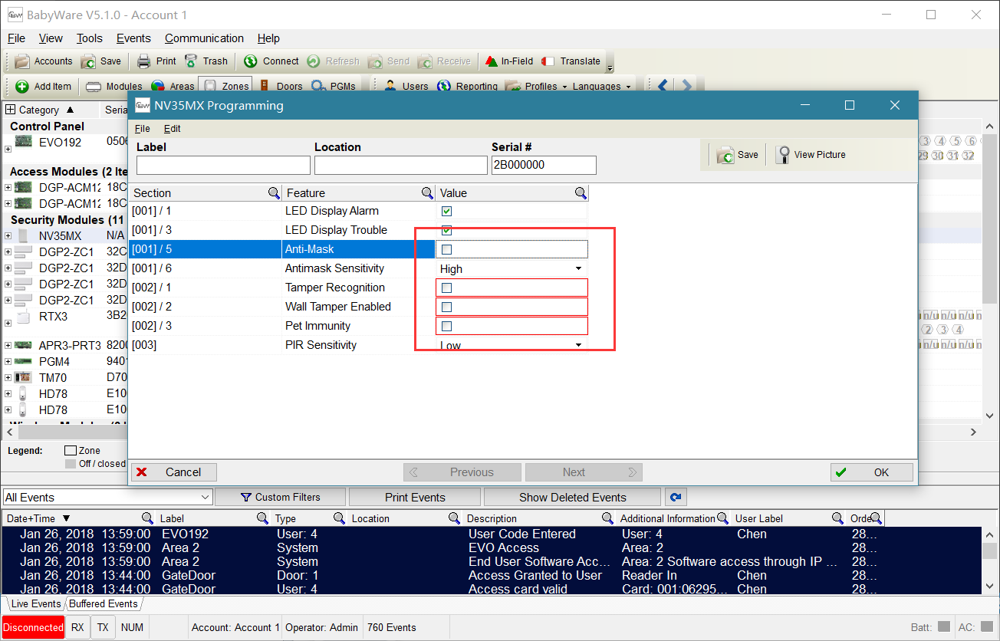
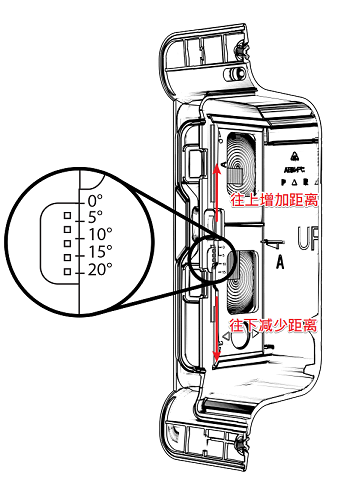

## 万能大法

如果碰到了一些奇怪的问题，通过常见方法都解决不了，请使用重新上电、复位和升降固件大法。

### 重新上电

断电的时候，记得给后备电源断电，上电的时候检查好接线以免发生意外。

### 复位

有些误操作会导致内置程序错乱，出现一些奇怪的现象，可通过复位解决，其中复位分为软件复位和硬件，为了提高效率和便于操作，建议用硬件复位，下面介绍硬件复位方法：

|设备|复位方法|
|:------|:------|
|EVO192主机|将主机板上Reset和AUX两个按钮同时长按，直到指示灯全部熄灭即可|
|EVOHD主机|长按Reset按钮，直到指示灯快闪的时候松开再短按一下即可|
|SP5500 SP6000 SP7000 MG5000 MG5050 MG6250主机|长按Reset按钮，直到指示灯快闪的时候松开短按一下即可|
|MG6250主机|断开电源，同时长按`*`和`#`按钮，然后上电，直到系统进入待机即可|
|SP4000 SP65主机|断开电源，将PG1和Z1短接，然后上电，等待指示灯闪烁即可|
|网络模块IP100 IP150|长按Reset按钮，直到指示灯快闪的时候松开短按一下即可|
|总线模块：总线模块包括操作键盘、总线探测器、无线信号覆盖模块RTX3、对接模块PRT3，防区模块，继电器模块等|仅针对EVO系统，在触摸屏键盘上操作步骤：**菜单** → **高级设置** → **安装设置** → **系统编程** → 输入`000000` → 输入`4001` → 输入模块序列号即可|

### 升降固件

固件是内置在设备中的程序文件，有些问题可能只适用于特定版本的固件。升降固件请看[刷固件工具(In-Field)使用说明](../../node2/infield/)，多数设备都可以通过连接主机进行升级，对于一些特殊的设备，升降级的时候需要直连设备，具体请咨询设备提供商。

## 通讯问题

---

### 报警后主机(通过电话线)无法拨号到手机

由于光纤改造，光纤猫的品牌太多，质量层次不齐，有些品牌光猫的电话线接口输出电压不符合国际标准（标准是48V-56V），通常表现为电话线电压过低，如果用万用表(直流档)测试电压，低于48v的，可以确定是不符合标准的，遇到这种情况，可以咨询运营商(电信，联通，移动)或者光猫厂家看是否有设置电压的参数选项或者更换光猫，如果还解决不了，可以选择枫叶GSM模块通过电话卡拨号解决。

### 报警后主机(通过电话卡模块)无法拨号到手机

这种情况一般都是信号质量问题导致的，可以尝试更换其他运营商(目前只支持联通和移动)的SIM卡或者加强信号质量来解决。

### EVO总线问题

**警告**：总线探测器数量超过20个以上，建议加HUB2总线驱动器模块，这是导致总线模块通信不稳定的因素之一。

#### 总线不通

请注意：总线接口的表示在不同设备上会有不同，如：（AUX+ AUX- GRN YEL），（RED BLK GRN YEL），（+ - GRN YEL）和（+ - G Y），这几种都是表示总线接口。

总线模块包含总线上的所有设备，总线探测器，操作键盘，防区模块，对接模块，继电器模块，无线信号覆盖模块等这些都是总线模块，如果遇到了搜不到的情况，有以下几种原因：

1. 线路问题，有可能短路，或者断路，请检测线路；
2. 电源问题，线路距离过长或者线材质量问题导致压降太大，设备端的电压衰减太多，已经不足以提供正常工作所需电源，请保证工作所需电源；
3. 设备（主机或总线模块）总线口短路，如果接错线，会直接烧坏总线口，请彻底切断电源，断开接线柱的线，用万用表测试总线口是否有短路新情况，如有短路，请联系设备提供商。有时候线渣掉进接线柱也可导致短路，所以接线的时候务必小心，如果有线渣，务必要清理干净。

排除以上情况后，可以尝试重启主机或进入高级编程搜索模块解决。

进入高级编程搜索命令操作步骤：请在触摸屏键盘上操作步骤：菜单 → 高级设置 → 安装设置 → 系统编程 → 输入`000000` → 输入`4005`  等待即可。

#### 总线偶尔掉线

线路问题和电源问题是导致整个故障的主要原因，请参考上面的解决思路，如果线路没有问题，多数都是电源供应不足导致，请保证电源供应，如何专业的给系统供电，请参考[电源布线方案](../../node1/wiring-method/#电源布线)。

## 探测器

---

### 总线探测器NV35MX

#### 显示在线，但一直开路

如果不是电源问题，有可能是防遮挡功能开启导致的，通过Babyware软件关闭防遮挡，防宠物功能可以解决，如图：

#### 黄灯一直闪烁

黄灯闪烁表示跟主机无法通信，首先请检查线路问题。

### 总线探测器NV780MX

NV780MX在调试的时候需要注意的几点说明：

如果不是总线接线方式，拨码4设为ON，表示探测器两边合并为一路信号输出，此时的接线方式有变化，**特别提示：之前的NC-R变为NC输出，NC-L变为NO输出**。如图：

如果不是总线接线方式，拨码4设为OFF，表示探测器两边分别有一路信号输出。如图：

如果距离不合适，通过下图的方式调节距离解决：

如果幕帘探测区域有遮挡物，可以通过下面的方法调节解决：

#### 主机搜不到

首先要排除是电源问题或者线路问题，可以尝试升级固件解决。

### 总线探测器DG467

#### 主机搜不到探测器

首先要排除是电源问题或者线路问题，然后看一下DG467的跳线j4，将j4设置为ON，即短接(j4为ON表示总线通讯模式，OFF表示继电器信号输出，默认是OFF)，如图：

## 操作键盘

---

### TM50/TM70

#### 出现花屏

这是由于系统突然断电导致SD卡内的文件损坏，可以尝试格式化SD卡，然后重新拷贝初始化文件到SD卡，如果格式化不成功，可能卡已损坏，请更换。SD卡初始化文件请到[资料服务器](http://support.senboll.com:8888/)下载，更具具体操作键盘型号找相应的SD卡文件，拷贝文件到SD卡根目录：，下面是TM50的文件路径，如图：

#### 图标显示不全

请通过键盘上的升级固件菜单解决。

#### Memory Read Error

`Memory Read Error！Error #：000029` 这是内存卡读取失败，请检查内存卡，如果损坏请更换。

#### 无法显示中文

有可能是SD卡文件的问题，请下载最新的文件，如果不是文件的问题，请在触摸操作键盘上切换语言。

EVO系列请参考下面的步骤：

## 警号

---

### 有线警号：待机状态有微弱的声音

请在警号接线端子上并接1K电阻解决。

## 防区模块

---

### 防区模块ZX1：Babyware软件无法编程双防区

由于ZX1停产，Babyware没有及时更新，请升级Babywrae软件版本(版本要求高于5.1)或者用键盘进入高级编程解决。
