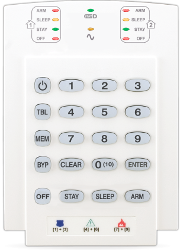
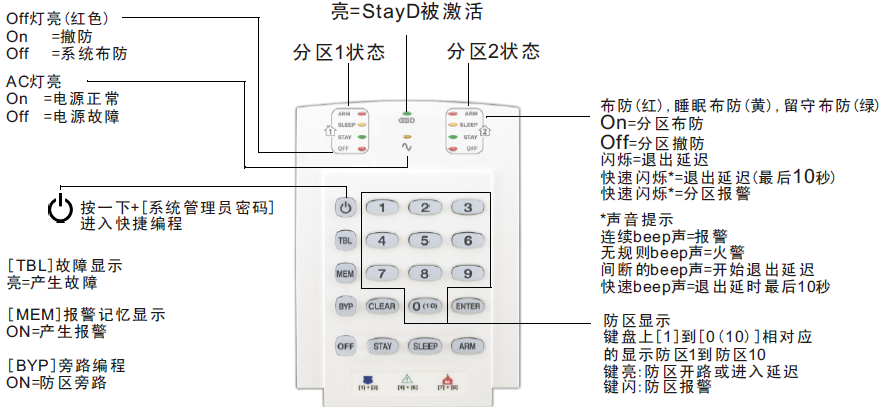

## 简介

这款键盘最多支持10个防区，面板上只有按钮和led指示灯，如果熟练掌握了使用方法，会很简单易用，缺点是不够直观。

## 功能参数

- 支持StayD模式
- 10防区LED显示屏
- 每个分区有独立的 布防 / 睡眠 / 留守 / 撤防 的LED状态指示
- 获得专利的KeyLight显示屏（按钮亮起表示相应的防区被触发）
- 1个键盘防区输入
- 独立设置的门铃防区
- 7个一键式操作功能键定义
- 同时按下3个键激活的紧急警报(110报警，119火警，120急救)
- 可调背光亮度
- 连接到4芯通讯总线
- 与MG5000，MG5050，MG5075和SP系列主机兼容

## 使用指南

面板图标说明：

### 布防

**布防**：顾名思义布置防护，让系统启动防护功能，或进入防护工作状态，此时已布防的防区一旦触发，会发生[报警](../../node1/important-knowledge/#%E6%8A%A5%E8%AD%A6alarm)。布防可以通过安防操作键盘，遥控器，手机APP，短信，电话，电脑等方式实现。

1. 键盘上输入用户密码（默认1234）→ ARM灯闪烁，开始倒计时，ARM灯常亮，系统布防成功。
2. 在键盘上长按ARM键2秒以上，ARM灯闪烁，开始倒计时，ARM灯常亮，系统布防成功。

### 撤防

**撤防**：顾名思义撤销防护，让系统撤销防护功能，或停止防护工作状态，此时已撤防的防区触发，不会发生报警。

键盘上输入用户密码（默认1234）- OFF灯常亮，系统撤防成功。

### 解除报警


一旦有报警发生，应第一时间力求减少人身和财产的损失，直到这种危险解除后，才能解除报警！


当系统发生报警时，键盘会弹出具体的报警防区或防区平面地图（需要提前设置），在紧急情况解除后，直接输入用户密码，系统会解除报警，当系统有2个分区时，解除报警的分区，另外一个分区状态不变。

### 查看防区状态

键盘上1-0（10）10个数字按钮分别对于1-10防区的状态，哪个防区开路（触发），哪个按钮就会亮，这些待机状态时总是实时显示的。

### 查看故障


一旦有故障发生，都会实时显示到屏幕上，为了系统正常使用，应尽快排除故障。如需支持，请联系安装人员或者直接拨打全国服务热线400-002-5577。


按TBL键去查看故障显示，当系统每产生一个新的故障，键盘将会每5秒发出‘滴滴’声，按TBL键停止发声，对照下表按相应的按键，查看具体故障，按CLEAR退出。

故障说明如下：

| 故障主菜单 | 故障子菜单 |
|---|---|
|1无线防区低电量|1到32防区低电量|
|2电源故障|1报警主机低/无电量 2报警主机交流电故障 3报警主机辅助电源过载 4无线键盘AC故障 5无线键盘蓄电池故障 6无线中继器AC故障 7无线中继器蓄电池故障 8无线声光警号交流电故障 9无线声光警号电池故障|
|3警铃故障|1警铃未接 2警铃过载|
|4通讯故障|1报警主机电活线监测故障 2中心电话号码1与报警主机通讯失败 3中心电话号码2与报警主机通讯失败 4寻呼机号码与报警主机通讯失败 5语音电话号码与控制主机通讯失败 6 PC与报警主机通讯失败 7与IP接收机或2通讯失败(GPRS) 8与IP接收机或2通讯失败(IP) 9GSM无服务(GSM网络故障) 10IP模块无服务(网络故障) STAYGSM  RF干扰 OFFIP接收机没有注册(IP/GPRS)|
|5防拆和防区线路故障|1到32防区防拆和线路故障|
|6模块防拆故障|12WPGM防拆故障 2键盘总线防拆故障 3ZX8总线模块防拆故障 4RTX3总线模块防拆故障 5无线声光警号故障|
|7火警回路故障|1到32火警防区回路故障|
|8时间丢失|-|
|9无线防区监测失败|1到32防区监测失败 STAY RF干扰故障|
|0(10)模块监测失败|1 2WPGM 2键盘总线故障(主机恢复不能清除此故障，要清除此故障，查看段号955) 3 ZX8总线模块故障 4RTX3总线模块故障 5无线键盘监测丢失 6无线中继器监测丢失 8VDMP3模块故障 9PCS系列模块故障 10IP模块故障 STAY无线声光警号|
|16键盘故障( K32/ K32RF)||
|17请将主机升级到V32或更高版本||
|SLEEP键盘故障(K10V/H  K636)||

### 查看报警记录

在系统撤防情况下，当有报警记录时，MEM键会亮起，按下MEM键，键盘上哪个键亮灯，说明该防区之前报警了，按CLEAR退出。

### 设置门铃防区

如果有个防区触发后，键盘或主机会有类似门铃的声音提示，这就是门铃防区功能。可以用来提示是否有人出现，通常在出入口会用到。

键盘1 - 0对应防区1到防区10，长按对应的按键，当响起‘滴滴滴滴’四声，表示门铃有效，再次长按，当响起‘滴’一声长音，门铃功能关闭。

### 校正系统时间

对于整个系统来说，需要记录所有发生的事件或者日志所发生的时间，就需要时钟功能，由于系统的时钟通常不能联网自动校准，时间长了会有误差，就需要人为校正。

1. 按下 &#xE7E8 键
2. 输入管理员密码（默认1234），此时 &#xE7E8  和按钮1开始闪烁
3. 按TBL键
4. 按5键，此时ARM灯闪烁
5. 输入时间HH:MM，此时ARM灯常亮，SLEEP闪烁
6. 输入年份YYYY，此时SLEEP灯常亮，STAY闪烁
7. 输入月份MM，此时STAY灯常亮，OFF闪烁
8. 输入日期MM，此时OFF，TBL和5闪烁
9. 按CLEAR退出

注意：依次按照HH:MM，YYYY，MM，DD输入时间。当输入小时HH=0-12，会出现3个选项，分别是124小时制，2AM，3PM；当输入HH=13-23，没有选项。
