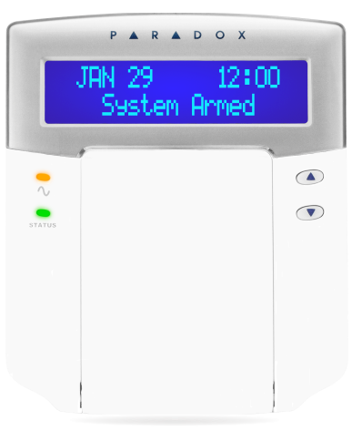
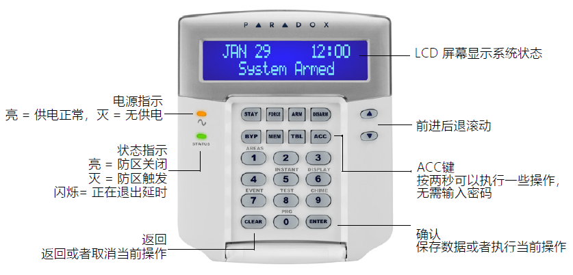

## 简介

这款键盘带液晶屏，支持所有分区的控制，状态显示，支持多国语言（遗憾的是不支持中文），LCD屏幕实时显示系统的状态，故障和时间等，相对比较直观。

k641操作键盘:

## 功能

- 美观大方的3D弧面设计
- 防区警报显示：锁定显示警报中的防区，直到系统撤防为止
- 可通过CONV4USB升级现场固件
- 简化的最终用户远程控制编程
- 支持EVO192和EVOHD
- 32个字符的蓝色LCD带有可编程标签（通过PMC编程钥匙，NEware或模块广播功能）
- 提供保加利亚语，克罗地亚语，捷克语，荷兰语，英语，法语，德语，希腊语，希伯来语，匈牙利语，意大利语，波兰语，葡萄牙语，俄语，斯洛伐克语，斯洛文尼亚语，西班牙语，瑞典语，土耳其语，立陶宛语，芬兰语和土耳其语
- 可分配给一个或多个分区
- 1个可寻址防区和1个PGM输出
- 独立设置的门铃防区
- 14个一键式快捷操作按钮
- 同时按下3个按键激活紧急警报
- 背光，对比度和滚动速度可调
- 使用12小时或24小时格式的显示时间
- 符合安规 EN50131 三级

## 使用指南

面板说明：

### 布防

布防模式说明：

| 布防模式 | 描述 |
|---|---|
|常规布防|外出- 整个区域被布防，在使用键盘布防的时候如果有防区开路会提示，可以旁路开路防区再布防。|
|强制布防|外出- 在布防的时候，如果有防区开路，会自动旁路开路的防区后再布防。|
|立即布防|留守- 将防区的延时防区类型会转为立即防区类型再布防，防区触发后没有延时，立即报警。|
|留守布防|留守- 仅仅布防周界防区，室内防区不会被布防，您可以在室内活动。|

**操作方法**

- 离开的时候（常规布防和强制布防）

|步骤|操作|
|---|---|
|1|输入Access Code （用户密码，默认是1234） - 如果是常规布防，请按下ARM 键，必须所在分区内所有的防区都是闭合的； - 如果是强制布防，请按下FORCE 键，防区如果开启了强制布防属性的时候，布防时防区状态不会影响。|
|2|选择分区序号即可布防该分区，或者按下0，布防全部分区。|

- 留守的时候（留守布防和立即布防）

|步骤|操作|
|---|---|
|1|输入Access Code （用户密码，默认是1234） - 如果是留守布防，请按下STAY 键，仅仅布防周界防区，您仍然可以在室内活动； - 如果是立即布防，请按下5 键，防区如果开启了强制布防属性的时候，布防时防区状态不会影响。|
|2|选择分区序号即可布防该分区，或者按下0，布防全部分区。|

### 撤防

- 全部撤防

|步骤|操作|
|---|---|
|1|输入Access Code （用户密码）|
|2|选择分区序号即可布防该分区，即可撤防该分区。|

- 部分撤防（比如只撤防室内分区）

|步骤|操作|
|---|---|
|1|输入Access Code （用户密码）|
|2|按下DISARM 键|
|3|选择分区序号即可布防该分区，即可撤防该分区。|

### 紧急报警

注意：此功能默认关闭，需要开启请联系安装人员。

在紧急情况发生的时候，可以按下键盘的组合键2 秒钟，实现有声或者无声报警，组合键定义如下：

|报警类型|按键组合|
|---|---|
|110 报警|1 和 3 同时按下|
|120 报警|4 和 6 同时按下|
|119 报警|7 和 9 同时按下|

### 取消报警

当系统发生报警时，键盘会显示某个防区报警，这时候直接输入用户密码（默认1234），系统会取消报警，当系统有多个分区报警时，仅取消报警的分区，其余分区状态不变。

### 查看防区状态

在未布防的时候状态如下表：

|防区状态|键盘显示|
|---|---|
|防区全部闭合（未触发）状态|键盘显示[All Disarmed]+时间|
|有防区是触发状态|键盘显示[Area 1 Not Ready]+[ 001 Zone Open]+[防区标签]|

### 查看故障

当有故障发生的时候，键盘的屏幕上会全部显示出来，应尽快排除故障。

|步骤|操作|
|---|---|
|1|按TBL 键|
|2|通过 &#xEB11  &#xEB0F 翻阅，有关详细的故障描述请参考下面的说明。|
|3|如果有故障发生，请尽快排除，如果不清楚怎么解决，请联系经销商。|
|4|按CLEAR 键退出|

故障说明如下：

| 故障主菜单 | 故障子菜单 |
|---|---|
|[1]System（系统故障）|[1]AC failure（交流电故障） [2]Battery trouble（后备电源故障） [3]Aux. current limit（辅助电源输出过载） [4]Bell current limit（警号输出接口过载） [5]Bell absent（警号未接） [6]ROM check error（ROM错误） [7]RAM check error（RAM错误）|
|[2]Communicator（通讯故障）|[1]TLM1（电话线故障） [2]Fail to Com. 1（com1故障） [3]Fail to Com. 2（com2故障） [4]Fail to Com. 3（com3故障） [5]Fail to Com. 4（com4故障） [6]Fail to Com. PC（PC通信错误）|
|[3]Module Trouble（模块故障）|[1]Module tamper（模块防拆故障） [2]Module ROM check error（模块ROM故障） [3]Module TLM trouble（模块拨号故障） [4]Module Fail to Com.（模块通信故障） [5]Printer trouble（打印机故障） [6]Module AC failure（模块交流电源故障） [7]Module battery failure（模块后备电源故障） [8]Module supply output（模块电源输出故障）|
|[4]Network (Combus) Troubles（总线故障）|[1]Missing keypad（键盘离线） [2]Missing module（模块离线） [3]Missing voice module（语音模块离线） [6]General failure（一般总线故障） [7]Combus overload（总线过载）|
|[5]Zone Tamper（防区防拆故障）|按5显示防拆故障的所有防区|
|[6]Zone Low Battery（防区电池电量不足故障）|按6显示电池电量不足的所有防区|
|[7]Zone Fault（防区故障）|按7显示火警回路防区故障|
|[8]Clock Loss（时间丢失）|按8重新设置时间|
|[9]GSM Troubles（GSM移动网故障）|[1]Missing GSM module（GSM模块掉线） [2]GSM RF jam supervision（移动网发生干扰故障） [3]No service（移动网无服务） [5]Fail to communicate with IP receiver 1（IP中心1通信失败） [6]Fail to communicate with IP receiver 2（IP中心2通信失败） [7]Fail to communicate with IP receiver 3（IP中心3通信失败） [8]Fail to communicate with IP receiver 4（IP中心14通信失败） [9]IP receiver unregistered（IP中心注册失败）|
|[10]IP Troubles（以太网故障）|[1]Missing IP module（网络模块掉线） [2]No service（无以太网） [3]Fail to communicate with IP receiver 1（IP中心1通信失败） [4]Fail to communicate with IP receiver 2（IP中心2通信失败） [5]Fail to communicate with IP receiver 3（IP中心3通信失败） [6]Fail to communicate with IP receiver 4（IP中心14通信失败） [7]IP receiver unregistered（IP中心注册失败）|

### 查看报警记录

可以通过键盘查看最近一次布防期间发生的报警事件。

|步骤|操作|
|---|---|
|1|如果是布防状态请先撤防|
|2|按MEM键，可以显示所有被触发过的防区，例如，防区1的报警记录显示为：Alarm Zone 001。通过 &#xEB11  &#xEB0F 翻阅。|
|3|按CLEAR 键退出|

### 设置门铃防区

如果有个防区触发后，键盘或主机会有类似门铃的声音提示，这就是门铃防区功能。可以用来提示是否有人出现，通常在出入口会用到。

|步骤|操作|
|---|---|
|1|输入用户密码（默认1234）|
|2|按9|
|3|使用 &#xEB11  &#xEB0F 键，选择一个防区，然后按ACC键开启或者取消该防区的门铃功能|
|4|按ENTER键保存|
|5|按CLEAR键退出|

### 校正系统时间

对于整个系统来说，需要记录所有发生的事件或者日志所发生的时间，就需要时钟功能，由于系统的时钟通常不能联网自动校准，时间长了会有误差，就需要人为校正。

|步骤|操作|
|---|---|
|1|输入用户密码（默认1234），再按TRBL键|
|2|按8|
|3|按 &#xEB11  &#xEB0F 选择或者输入需要设置的时间参数，按ENTER键保存。|
|4|按 &#xEB11  &#xEB0F 选择或者输入需要设置的日期参数|
|5|按ENTER键保存退出|
