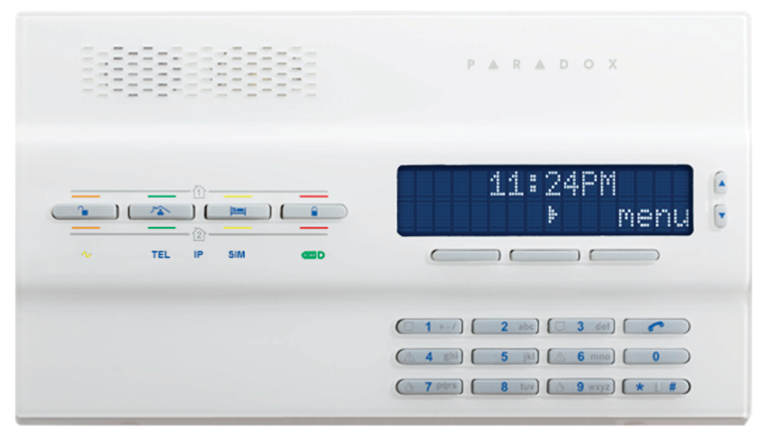
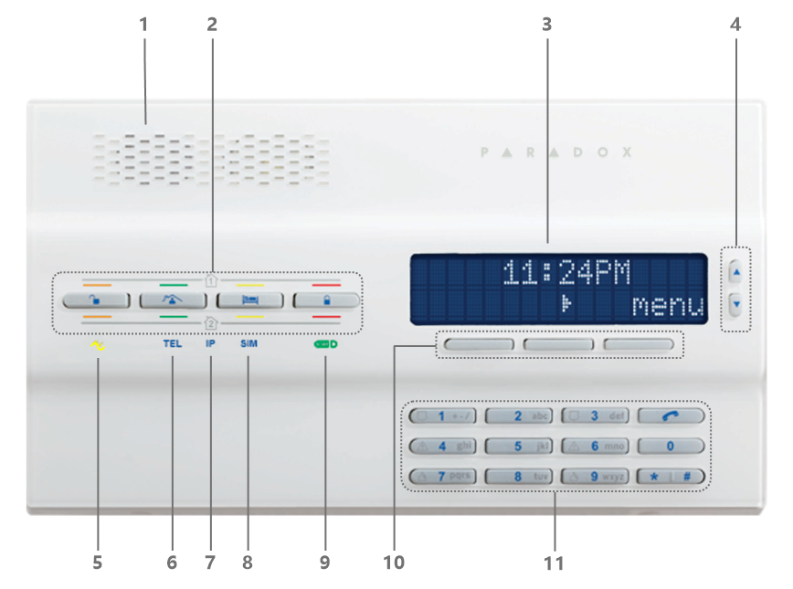
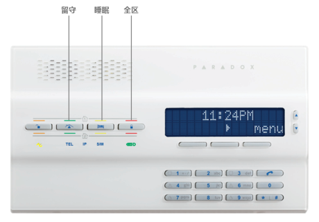
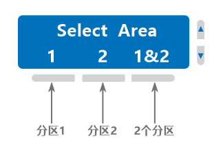
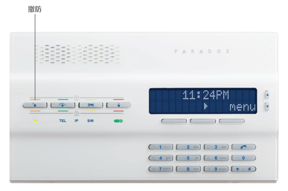
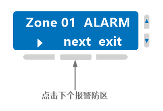

## 简介

这是一款集成了键盘的报警主机，操作的时候带语音提示，支持2个分区的控制，状态显示，支持多国语言（遗憾的是不支持中文），LCD屏幕实时显示系统的状态，故障和时间等，相对比较直观。

MG6250一体化报警主机:

## 功能

- 同步五通道报告功能可通过GPRS，GSM，SMS，语音和传统电话线提供报告，并支持预定义的通信顺序，以节省安装时间
- 支持2个分区和多达64个无线防区
- 支持带有2张SIM卡（GPRS14）的可选四频GPRS / GSM模块
- 内置无线收发器（433或868 MHz）
- 通过GSM或固定电话的进行免提电话对讲
- 内置语音和个人传呼报告Pager（最多8个电话号码）
- 双向语音对讲 （通过GSM或固定电话）
- 支持16个用户和16个遥控器(用户一对一分配)
- 8个无线PGM（2个I/O可以有线连接）
- 256个事件缓存
- 支持4个无线警报器（SR150）
- 支持4个无线键盘（K32RF/K35/K37），仅显示前32个防区
- 支持4个无线中继器（RPT1）
- 支持16个双向遥控器（REM2/REM25/REM3）
- 内置90dB警笛
- 通过GPRS远程固件升级
- 通过GSM完全语音菜单式互动的电话远程遥控访问
- 可自定义防区语音标签和菜单指导的高质量声音
- 家庭电话消息留言中心（带时间水印，最多30秒）
- 闹钟功能
- 支持安规 EN50131 二级

## 使用指南

面板说明：

1：扬声器  
2：布撤防快捷键，分别是撤防、留守布防、睡眠布防和全区布防；  
3：LCD屏幕  
4：菜单上下滚动按钮  
5：系统电源状态指示  
6：电话功能工作状态指示 确认保存或者执行当前操作并退出  
7：IP网络工作状态指示  
8：SIM卡状态  
9：StayD模式指示  
10：对应LCD菜单键  
11：输入键盘  

### 布防

布防模式：  

- 全区：布防当前分区下的所有防区
- 睡眠：跟全区布防只有一点不同，即[延时防区](../../node1/important-knowledge/#%E9%98%B2%E5%8C%BA-zone)触发后会立即（无延时）报警。
- 留守：仅布防部分防区（非留守防区），通俗的讲，就是暂时禁用内部的防区，只启用外围的防区。如：周界防区，您仍然可以在室内活动。

**布防操作方法：**


默认情况下，如果有防区正在处于触发状态（打开状态），会执行强制布防。


如果只有1个分区：

- 方法1：在面板上，直接长按全区、睡眠和留守快捷键超过3秒，系统将进入布防倒计时，直到布防成功。
- 方法2：在面板上，按全区、睡眠和留守快捷键，输入用户密码（默认1234），系统将进入布防倒计时，直到布防成功。

如果有2分区，在布防操作的时候，需要先选择分区，如下：

布防成功后布防模式对应的按键处的指示灯会亮起，会有语音提示，同时LCD屏幕上会显示。如：分区1布防成功后，LCD显示如下：

### 撤防

如果只有1个分区：

在面板上，直接按撤防快捷键，输入用户密码（默认1234），执行撤防，操作成功后，撤防快捷键处的指示灯会亮起，同时会有语音提示。

如果有2分区，撤防操作的时候，需要先选择分区，如下：

### 解除报警


一旦有报警发生，应第一时间力求减少人身和财产的损失，直到这种危险解除后，才能解除报警！


当系统发生报警时，主机扬声器和声光警号会启动，同时LCD屏上会显示某个防区报警，如下：

解除报警请直接输入用户密码（默认1234），系统会解除报警，当系统有多个分区报警时，仅解除报警的分区，其余分区状态不变。

### 查看防区状态

在未布防的情况下：

**情况一：无防区开路**

如果只有1个分区，防区全部闭合（未触发）状态，显示：`System Ready`或`Area 1 Ready`；

如果有2个分区，交替显示`Area 1 Ready`和`Area 2 Ready`，表示所有防区都是未触发状态。

**情况二：有防区开路**

如果只有1个分区，有防区开路（触发）时，键盘显示`Area 1 Not Ready`，点击view对应的按键查看开路防区，同时伴有语音提示，如图：

如果有2个分区，交替显示`Area 1 Unready`或`Area 2 Unready`，表示该分区下有防区处于触发状态。

### 查看故障


一旦有故障发生，都会实时显示到屏幕上，为了系统正常使用，应尽快排除故障。如需支持，请联系安装人员或者直接拨打全国服务热线400-002-5577。


|步骤|操作|
|---|---|
|1|按TBL 键|
|2|通过 &#xEB11  &#xEB0F 翻阅，有关详细的故障描述请参考下面的说明。|
|3|如果有故障发生，请尽快排除，如果不清楚怎么解决，请联系经销商。|
|4|按CLEAR 键退出|

故障说明如下：

| 故障主菜单 | 故障子菜单 |
|---|---|
|[1]System（系统故障）|[1]AC failure（交流电故障） [2]Battery trouble（后备电源故障） [3]Aux. current limit（辅助电源输出过载） [4]Bell current limit（警号输出接口过载） [5]Bell absent（警号未接） [6]ROM check error（ROM错误） [7]RAM check error（RAM错误）|
|[2]Communicator（通讯故障）|[1]TLM1（电话线故障） [2]Fail to Com. 1（com1故障） [3]Fail to Com. 2（com2故障） [4]Fail to Com. 3（com3故障） [5]Fail to Com. 4（com4故障） [6]Fail to Com. PC（PC通信错误）|
|[3]Module Trouble（模块故障）|[1]Module tamper（模块防拆故障） [2]Module ROM check error（模块ROM故障） [3]Module TLM trouble（模块拨号故障） [4]Module Fail to Com.（模块通信故障） [5]Printer trouble（打印机故障） [6]Module AC failure（模块交流电源故障） [7]Module battery failure（模块后备电源故障） [8]Module supply output（模块电源输出故障）|
|[4]Network (Combus) Troubles（总线故障）|[1]Missing keypad（键盘离线） [2]Missing module（模块离线） [3]Missing voice module（语音模块离线） [6]General failure（一般总线故障） [7]Combus overload（总线过载）|
|[5]Zone Tamper（防区防拆故障）|按5显示防拆故障的所有防区|
|[6]Zone Low Battery（防区电池电量不足故障）|按6显示电池电量不足的所有防区|
|[7]Zone Fault（防区故障）|按7显示火警回路防区故障|
|[8]Clock Loss（时间丢失）|按8重新设置时间|
|[9]GSM Troubles（GSM移动网故障）|[1]Missing GSM module（GSM模块掉线） [2]GSM RF jam supervision（移动网发生干扰故障） [3]No service（移动网无服务） [5]Fail to communicate with IP receiver 1（IP中心1通信失败） [6]Fail to communicate with IP receiver 2（IP中心2通信失败） [7]Fail to communicate with IP receiver 3（IP中心3通信失败） [8]Fail to communicate with IP receiver 4（IP中心14通信失败） [9]IP receiver unregistered（IP中心注册失败）|
|[10]IP Troubles（以太网故障）|[1]Missing IP module（网络模块掉线） [2]No service（无以太网） [3]Fail to communicate with IP receiver 1（IP中心1通信失败） [4]Fail to communicate with IP receiver 2（IP中心2通信失败） [5]Fail to communicate with IP receiver 3（IP中心3通信失败） [6]Fail to communicate with IP receiver 4（IP中心14通信失败） [7]IP receiver unregistered（IP中心注册失败）|

### 查看报警记录

可以通过键盘查看最近一次布防期间发生的报警事件。

|步骤|操作|
|---|---|
|1|如果是布防状态请先撤防|
|2|按MEM键，可以显示所有被触发过的防区，例如，防区1的报警记录显示为：Alarm Zone 001。通过 &#xEB11  &#xEB0F 翻阅。|
|3|按CLEAR 键退出|

### 设置门铃防区

如果有个防区触发后，键盘或主机会有类似门铃的声音提示，这就是门铃防区功能。可以用来提示是否有人出现，通常在出入口会用到。

|步骤|操作|
|---|---|
|1|按MENU|
|2|按6|
|3|输入用户密码（默认1234）|
|4|使用 &#xEB11  &#xEB0F 键，选择一个防区，然后按ACC键开启或者取消该防区的门铃功能|
|5|按ENTER键保存|
|6|按CLEAR键退出|

### 校正系统时间

对于整个系统来说，需要记录所有发生的事件或者日志所发生的时间，就需要时钟功能，由于系统的时钟通常不能联网自动校准，时间长了会有误差，就需要人为校正。

|步骤|操作|
|---|---|
|1|按MENU|
|2|按9|
|3|输入用户密码（默认1234|
|4|按 &#xEB11  &#xEB0F 选择或者输入需要设置的时间参数，按ENTER键保存。|
|5|按 &#xEB11  &#xEB0F 选择或者输入需要设置的日期参数|
|6|按ENTER键保存退出|
