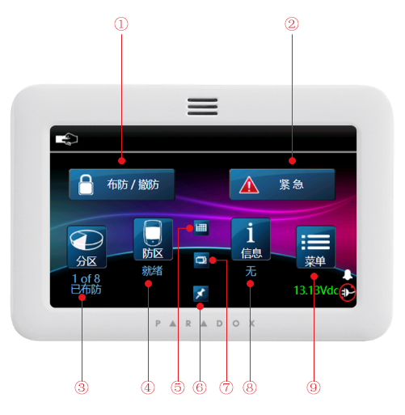
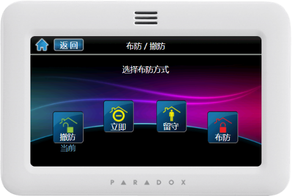
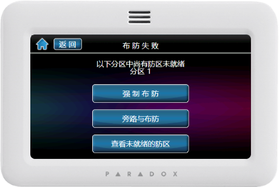
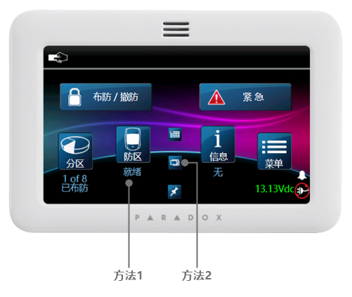

## 简介

这款全屏触摸键盘，支持所有分区的控制，状态显示，支持多国语言（包括中文），具有直观的菜单和图标，滚动页面时超快的响应时间以及清晰，精确的菜单驱动提示；使用户体验比以往更轻松，更友好。

TM50触摸屏操作键盘:

## 功能

- 纤薄时尚的设计
  - 5.0英寸/12.7厘米鲜艳的LCD彩色显示屏（480 x 272像素）
  - 直观的基于图标的菜单驱动交互方式, 无需手动输入控制命令
- 控制多达8个PGM输出
- 可通过Micro SD卡进行现场固件升级
- 强大的先进处理器以提供更强大的界面响应和更好的交互体验
- 板载1个防区/温度输入，用于连接检测设备或任何外部温度传感器（10K OHM热敏电阻）
- 通过Web应用程序定制语言翻译版本
- 表面安装尺寸 14.4 x 9.6 x 1.4厘米（5.7 x 3.8 x 0.6英寸）
- 提供经典的钢琴黑和珍珠白，以及其他令人兴奋的颜色选择

## 使用指南

面板说明：

① 布撤防操作  
② 紧急报警快捷键  
③ 所有分区  
④ 所有防区  
⑤ 防区实时状态展示  
⑥ 防区平面分布图  
⑦ 屏保  
⑧ 所有消息，故障，日志等  
⑨ 菜单入口

### 布防

- EVO系列

|步骤|操作|
|---|---|
|步骤1|按[分区1]键（仅有一个分区）或[布防/撤防]键（多个分区） → 输入用户密码（默认是1234）|
|步骤2|选择布防类型： 方式一：[布防]，布防当前分区下的防区； 方式二：[留守]，仅布防部分防区（非留守防区），如：周界防区，您仍然可以在室内活动； 方式三：[立即]，跟方式一只有一点不同：[延时防区](../../node1/important-knowledge/#%E9%98%B2%E5%8C%BA-zone)触发后会立即（无延时）报警。|
|步骤3|步骤2执行后，如果有防区正在处于触发状态（未就绪），将出现一个提示界面：  - 先点[查看未就绪的防区]来检查这些防区，以排除隐患； - 在确认未就绪的防区无安全隐患，可以选择[强制布防]或者[旁路与布防]，此时这些未就绪的防区将会失效。
|步骤4|执行完上面的步骤，系统将进入布防倒计时，直到布防。|

### 撤防

|步骤|操作|
|---|---|
|1|按[分区1]键（仅有一个分区）或[布防/撤防]键（多个分区） → 输入用户密码（默认是1234）|
|2|若只有一个分区，直接可以撤防，若多个分区，先选择所需分区再执行撤防即可。|

### 取消报警

当系统发生报警时，键盘会显示某个防区报警，这时候直接输入用户密码（默认1234），系统会取消报警，当系统有多个分区报警时，仅取消报警的分区，其余分区状态不变。

### 查看防区状态

在撤防状态，有两种方法，如下图：

方法一：进入防区列表逐个查看；方法二：预览所有防区实时状态。

### 查看故障

当有故障发生的时候，键盘的屏幕上会全部显示出来，应尽快排除故障。

|步骤|操作|
|---|---|
|1|按TBL 键|
|2|通过 &#xEB11  &#xEB0F 翻阅，有关详细的故障描述请参考下面的说明。|
|3|如果有故障发生，请尽快排除，如果不清楚怎么解决，请联系经销商。|
|4|按CLEAR 键退出|

故障说明如下：

| 故障主菜单 | 故障子菜单 |
|---|---|
|[1]System（系统故障）|[1]AC failure（交流电故障） [2]Battery trouble（后备电源故障） [3]Aux. current limit（辅助电源输出过载） [4]Bell current limit（警号输出接口过载） [5]Bell absent（警号未接） [6]ROM check error（ROM错误） [7]RAM check error（RAM错误）|
|[2]Communicator（通讯故障）|[1]TLM1（电话线故障） [2]Fail to Com. 1（com1故障） [3]Fail to Com. 2（com2故障） [4]Fail to Com. 3（com3故障） [5]Fail to Com. 4（com4故障） [6]Fail to Com. PC（PC通信错误）|
|[3]Module Trouble（模块故障）|[1]Module tamper（模块防拆故障） [2]Module ROM check error（模块ROM故障） [3]Module TLM trouble（模块拨号故障） [4]Module Fail to Com.（模块通信故障） [5]Printer trouble（打印机故障） [6]Module AC failure（模块交流电源故障） [7]Module battery failure（模块后备电源故障） [8]Module supply output（模块电源输出故障）|
|[4]Network (Combus) Troubles（总线故障）|[1]Missing keypad（键盘离线） [2]Missing module（模块离线） [3]Missing voice module（语音模块离线） [6]General failure（一般总线故障） [7]Combus overload（总线过载）|
|[5]Zone Tamper（防区防拆故障）|按5显示防拆故障的所有防区|
|[6]Zone Low Battery（防区电池电量不足故障）|按6显示电池电量不足的所有防区|
|[7]Zone Fault（防区故障）|按7显示火警回路防区故障|
|[8]Clock Loss（时间丢失）|按8重新设置时间|
|[9]GSM Troubles（GSM移动网故障）|[1]Missing GSM module（GSM模块掉线） [2]GSM RF jam supervision（移动网发生干扰故障） [3]No service（移动网无服务） [5]Fail to communicate with IP receiver 1（IP中心1通信失败） [6]Fail to communicate with IP receiver 2（IP中心2通信失败） [7]Fail to communicate with IP receiver 3（IP中心3通信失败） [8]Fail to communicate with IP receiver 4（IP中心14通信失败） [9]IP receiver unregistered（IP中心注册失败）|
|[10]IP Troubles（以太网故障）|[1]Missing IP module（网络模块掉线） [2]No service（无以太网） [3]Fail to communicate with IP receiver 1（IP中心1通信失败） [4]Fail to communicate with IP receiver 2（IP中心2通信失败） [5]Fail to communicate with IP receiver 3（IP中心3通信失败） [6]Fail to communicate with IP receiver 4（IP中心14通信失败） [7]IP receiver unregistered（IP中心注册失败）|

### 查看报警记录

可以通过键盘查看最近一次布防期间发生的报警事件。

|步骤|操作|
|---|---|
|1|如果是布防状态请先撤防|
|2|按MEM键，可以显示所有被触发过的防区，例如，防区1的报警记录显示为：Alarm Zone 001。通过 &#xEB11  &#xEB0F 翻阅。|
|3|按CLEAR 键退出|

### 设置门铃防区

如果有个防区触发后，键盘或主机会有类似门铃的声音提示，这就是门铃防区功能。可以用来提示是否有人出现，通常在出入口会用到。

|步骤|操作|
|---|---|
|1|按MENU|
|2|按6|
|3|输入用户密码（默认1234）|
|4|使用 &#xEB11  &#xEB0F 键，选择一个防区，然后按ACC键开启或者取消该防区的门铃功能|
|5|按ENTER键保存|
|6|按CLEAR键退出|

### 校正系统时间

对于整个系统来说，需要记录所有发生的事件或者日志所发生的时间，就需要时钟功能，由于系统的时钟通常不能联网自动校准，时间长了会有误差，就需要人为校正。

|步骤|操作|
|---|---|
|1|按MENU|
|2|按9|
|3|输入用户密码（默认1234|
|4|按 &#xEB11  &#xEB0F 选择或者输入需要设置的时间参数，按ENTER键保存。|
|5|按 &#xEB11  &#xEB0F 选择或者输入需要设置的日期参数|
|6|按ENTER键保存退出|
