## 简介

实现将文本消息和视频消息推送至用户手机微信端的一款安防消息推送方案。微信在国内可以说是必装的手机应用，消息推送的稳定性、时效性有保障，我们正是基于此推出了微信端解决方案。至少有2个优势：

1. 应用越多手机越慢大家都知道，这种方案避免手机安装过多的应用程序。
2. 经过测试微信推送的时效性目前来说是最靠谱的，胜过系统级推送，这对于安防报警需求来说很重要。

## 功能

- 支持4路（最大1080P）高清IPC接入，支持三码流
- 4路高清IPC接入
- 支持1080P/720P/WD1/4CIF/DCIF/2CIF/CIF/QCI分辨率录像
- 1个板载有线防区，1路继电器输出
- 支持报警联动视频复核
- 支持视频移动侦测、视频遮挡、视频丢失，支持30s（2M码流，全帧率）延时预览，延时时间可配置
- 支持通过网络、3G/4G传输报警、视频数据
- 支持APP（报警推送、视频预览、视频回放、远程布撤防、消警、防区编程等功能）
- 支持2000条报警时间记录、500条操作事件记录，500条用户管理操作记录，支持原创搜索
- 查询事件日志
- 支持独立的以太网接警中心，支持2组独立的3G/4G接警中心
- 支持定时布撤防（日常计划、优先计划）
- 支持主机防拆报警，支持探测器防拆报警
- 支持1路串口
- 支持TF卡本地录像存储
- 支持微信平台，事件及报警视频推送

## 操作指南

我们的微信端给用户提供了实时的消息推送，包括文字报警消息和视频报警消息，故障消息，布撤防消息，还有系统的日志等其他消息，这些消息保存在我们的后端服务器上，这一点对于有些极端情况会很有用，如：入侵者可能会破坏安防和监控设备，或者带走，但微信端还有入侵报警消息和视频，这些都可以为后期警察侦破案件提供有力的证据！

### 开通微信端

请使用手机微信扫描以下二维码，关注公众，如图：  

然后进入公众号 → **账户管理** → **账号管理**，按照页面提示注册账户。

### 布撤防操作

告别复杂繁琐的操作，通过微信端实时对安防系统进行布撤防操作，进入公众号点**主机控制** → **分区控制**，即可实现布撤防操作，如图：
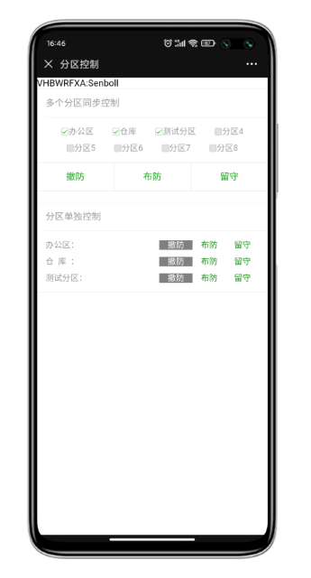

### 查询事件

事件查询是很有用的一个功能，为事后的核实提供重要的证据，我们提供了多种事件类型，进入公众号点**主机控制** → **分区控制**，选择需要查询的条件，如图事件类型，时间等条件，如图：

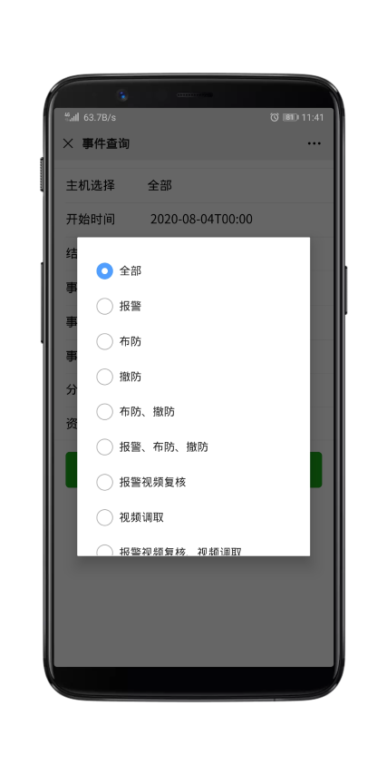
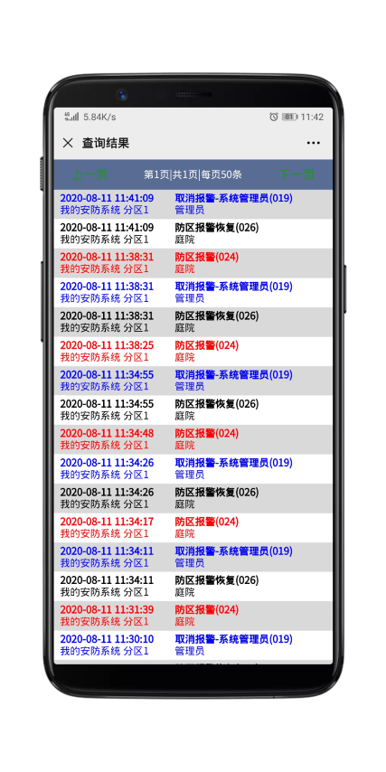

### 查询系统状态

进入公众号点**主机控制** → **主机状态**，即可显示当前系统的状态，包含分区和联动的监控摄像头状态，如图：
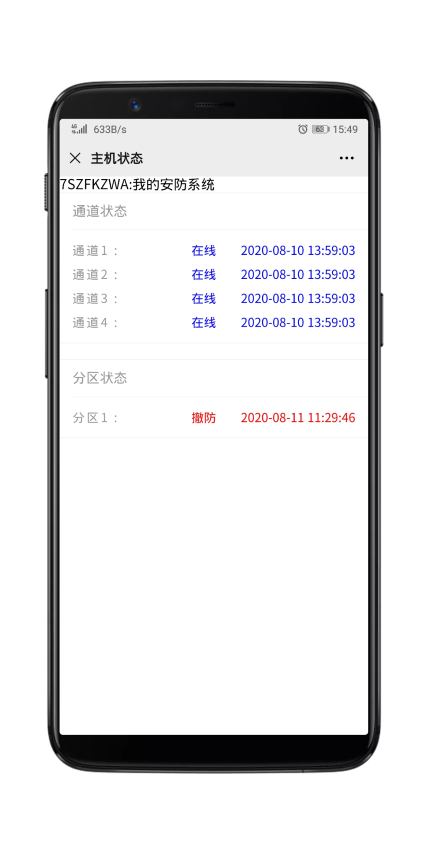

### 调取现场实时视频

进入公众号点**主机控制** → **防区视频**，在打开的页面，点击相应的通道所对应调取的时间来获取现场视频，如图：
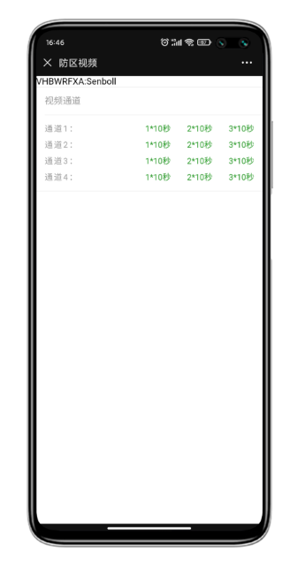

### 设置防区，分区，用户，门，通道等

回到公众号首页点击**账户管理** → **账户管理**，在弹出的页面按住已添加的主机左滑，将打开更多配置选项，如图：

打开资源设置页面，对主机的一些资源设置，包含防区，分区，用户，门，视频通道的标签等，如图：
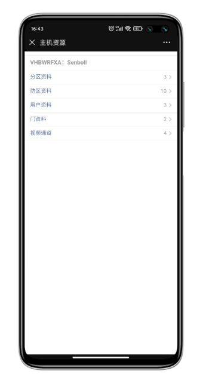

### 添加其他用户

- 生成新用户二维码

新用户需要提前关注此公众号，并在公众号首页点击**账户管理** → **账户管理**，在弹出的页面下面点**成为成员**，将会生成二维码，如图：
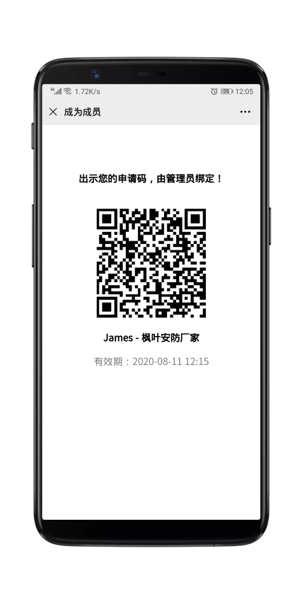

- 管理员回到公众号首页点击**账户管理** → **账户管理**，在弹出的页面按住已添加的主机左滑，将打开更多配置选项，选择**成员**选项，在打开添加成员的设置页面点**添加成员**，然后扫描上一步新用户的二维码，同时对其资料和权限做一些设置。如图：
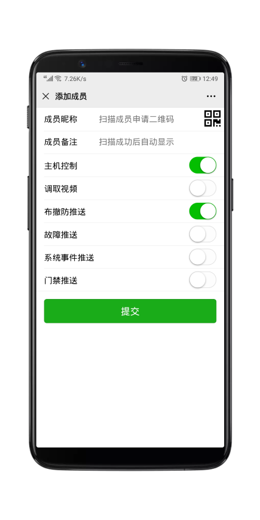

### 缴费

回到公众号首页点击**账户管理** → **充值缴费**，在弹出的新页面点击续费，如图：
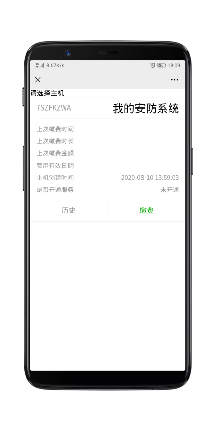

接下来的页面中选择**一年/或三年**，点击**确认支付**，如图：
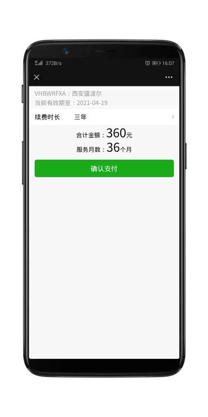

### 售后服务

进入公众号点**客户服务**，选择对应选项来获取我们的服务。如图：
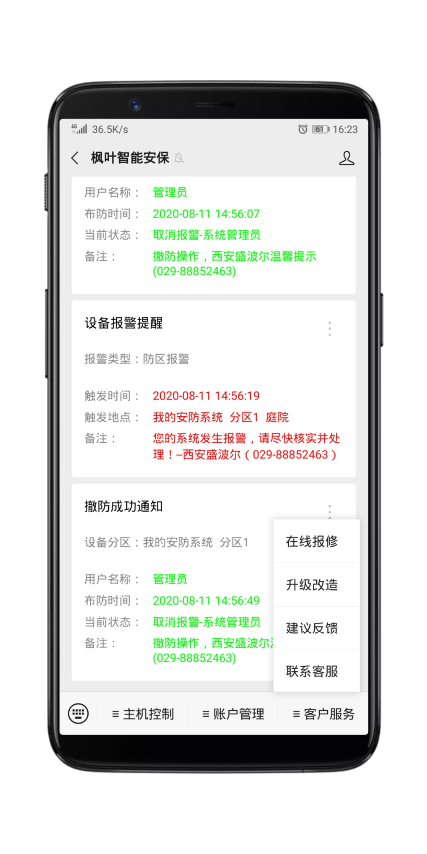
