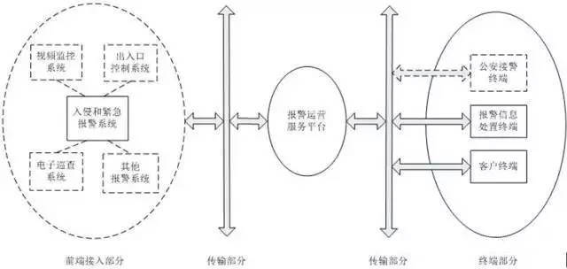
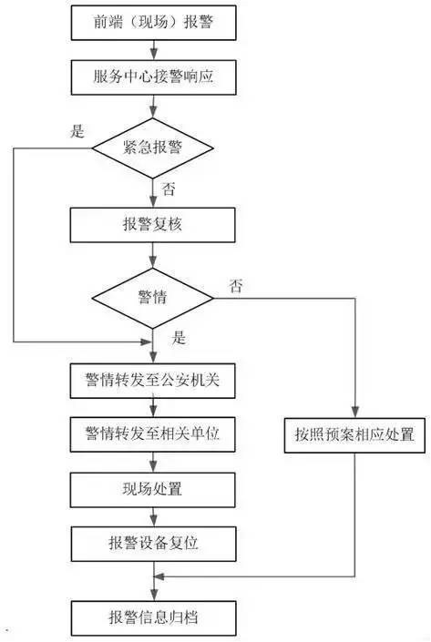

报警运营服务规范

Regulations on security alarm services

以下请参考标准内容

# 前言

本标准的全部技术内容为强制性。
本标准按照GB/T 1.1-2009给出的规则起草。
请注意本标准的某些内容有可能涉及专利，本标准的发布机构不应承担识别这些专利的责任。
本标准由公安部治安管理局提出。
本标准由全国安全防范报警系统标准化技术委员会（SAC/TC100）归口。
本标准起草单位：公安部治安管理局、公安部第一研究所、北京国通创安报警网络技术有限公司、北京声迅电子股份有限公司、成都理想科技开发有限公司、北京万家安全系统有限公司、内蒙古鼎升安防科技有限公司、富盛科技股份有限公司、上海天跃科技股份有限公司。
本标准主要起草人：刘威、顾岩、周群、秦嘉黎、聂蓉、曲明、羊贵祥、杨栋梁、蔡永生、娄健、彭华、高开文。

## 范围

本标准规定了报警运营服务的技术要求和服务要求。
本标准适用于报警运营服务及其监督管理。

## 规范性引用文件

下列文件对于本文件的应用是必不可少的。凡是注日期的引用文件，仅注日期的版本适用于本文件。凡是不注日期的引用文件，其最新版本（包括所有的修改单）适用于本文件。
GB/T 19001 质量管理体系 要求
GB/T 28181 安全防范视频监控联网系统信息传输、交换、控制技术要求
GB 50348 安全防范工程技术规范
GB 50394 入侵报警系统工程设计规范
GB 50395 视频安防监控系统工程设计规范
GB 50396 出入口控制系统工程设计规范
GA/T 644 电子巡查系统技术要求
GA/T 669.1-2008 城市监控报警联网系统 技术标准 第1部分：通用技术要求
GA/T 669.7-2008 城市监控报警联网系统 技术标准 第7部分：管理平台技术要求
GA 1081 安全防范系统维护保养规范
GA/T 1211 安全防范高清视频监控系统技术要求

## 术语、定义和缩略语

### 术语和定义

GB 50348、GB 50394中界定的以及下列术语和定义适用于本文件。
　　
报警运营服务 security alarm services 

按照合同约定由报警运营服务从业单位向客户提供的为保障其人身和财产安全的报警服务活动，主要包括报警信息和视音频信息接收、分析和处理、技术系统维护及现场处置等。

报警运营服务从业单位  security alarm service providers

依法开展报警运营服务的企业及自行负责内部报警运营服务的企事业单位。

报警运营服务中心 security alarm service center

由报警运营服务从业单位建立的、在报警运营服务活动中对各种信息进行汇聚、存储、分析、判别、处置、转发、查询、统计以及指挥调度的场所。

警情信息 escalate to police

防护现场发生入侵、盗窃、抢劫、破坏、爆炸等危害社会公共安全及人身和财产安全事件时的报警信息及视音频等信息。

警情漏报  leakage alarm

因报警运营服务从业单位工作失误或设备故障等原因导致未将警情信息传送到公安机关。

警情误报  false alarm

因报警运营服务从业单位工作失误或设备故障等原因导致非警情信息传送到公安机关。

警情转发  alarm forward

报警运营服务中心向公安机关或相关单位传送警情信息的过程。
　　
现场处置 alarm scene disposal

报警发生后，报警运营服务从业单位派员到报警现场进行报警信息复核、报警装置复位和现场保护的过程。

值机员 on-duty staff

在报警运营服务中心负责接收、处理报警信息、视音频信息、故障信息及受理咨询、投诉的人员。

维护员 maintenance of equipment security officer

负责技术系统及设备故障修复、维护保养、设备状态恢复的人员。  
　　
现场处置员 alarm disposal members

负责巡逻、值守以及报警现场处置的人员。

客户  customer

向报警运营服务从业单位购买服务的机构或个人。

重要客户  key customer

依法列入治安保卫重点单位范围的客户单位。

### 缩略语

下列缩略语适用于本文件。
PSTN—公共交换电话网络
（Public Switched Telephone Network）
IP—因特网协议（Internet Protocol） 

## 技术要求

### 技术系统组成

技术系统应用结构

报警运营服务技术系统（以下简称技术系统）通常由前端接入部分、报警运营服务平台（以下简称服务平台）、终端部分和传输部分组成，其基本逻辑结构见图1。根据防护手段、信息传输方式、控制方式以及客户类别等不同,技术系统可有多种应用模式。

图1 技术系统基本逻辑结构

前端接入部分
前端接入部分可由客户单位防护现场的入侵和紧急报警、视频监控、出入口控制、电子巡查和其他报警系统组成。

服务平台

服务平台设置在报警运营服务中心（以下简称服务中心），主要由报警信息接收设备、显示/存储设备、控制设备、服务器及核心软件等组成，对技术系统的设备、客户、网络、安全、业务等进行综合管理。服务平台支持多级、多中心架构，支持本地或跨区域的报警运营服务。

终端部分

终端部分包括报警信息处置终端和客户终端，根据需要可为公安机关提供接警终端。报警信息处置终端用于现场处置员与服务平台交互信息。客户终端用于客户或相关单位接收警情等信息。

传输部分

传输部分包括传输网络和传输设备，传输网络可分为专用网络和公共通信网络，传输方式可分为有线传输和无线传输。

### 技术系统功能及性能

前端接入部分

入侵和紧急报警系统除应符合GB 50394的相关要求外，还应符合下列要求：

- 发生报警时，将报警信息传送至服务平台；
- 紧急报警装置发出的报警信息应能根据需求直接传送至公安机关；
- 用于报警信息传输的线路上不应挂接其它设备；
- 通过PSTN线路接入的具有计时功能的设备与北京时间的偏差小于等于30s。

视频监控系统除应符合GB 50395的相关要求外，还应符合下列要求：

- 发生报警时，应将与入侵和紧急报警系统联动的视频图像信息传送至服务平台；
- 设备发生故障（包括硬盘故障、编码器故障、视频信号丢失等）时，应自动向服务平台实时传送故障报警信息；
- 高清视频监控系统应符合GA/T 1211的相关规定。
出入口控制系统应符合GB 50396的相关规定。
电子巡查系统应符合GA/T 644的相关规定。
其他报警系统应符合相关标准规定。

服务平台

报警响应

服务平台接收报警信息时，应能启动声光报警提示，显示报警信息（包括：客户信息、报警类型、防区信息、位置信息、处置预案等）等响应。报警信息从前端触发到服务平台响应的时间应符合下列要求：

- 经由PSTN网络传输的，小于等于20s；
- 经由IP网络传输的，小于等于4s；
- 经由无线网络采用GPRS及以上速率传输的，小于等于5s。

报警复核

报警发生时，具有报警复核功能的服务平台应符合下列要求：

- 具有音频复核功能的服务平台，应自动从预录音频信息的任意指定时间点开始播放，同时触发服务平台的录音设备；
- 具有视频复核功能的服务平台，应自动从预录视频信息的任意指定时间点开始播放预录图像和现场实时图像，每秒不少于15帧，同时触发服务平台的录像设备。重要客户应采用视频复核方式；
- 具有图片复核功能的服务平台，应自动从预录图片的任意指定时间点开始显示等分抽取的图片，每秒不少于4幅，同时触发服务平台的存储设备。

视频监控

服务平台的视频监控应符合下列要求：

- 应能按照指定设备、指定通道进行实时浏览、多画面浏览、镜头及云台控制；
- 应能按防护对象的不同区域、类别、数量、时间等进行分组轮巡。

记录存储与播放

服务平台的记录存储与播放应符合下列要求：

- 存储报警信息和处置信息，包括报警时间、报警类型、响应时间、复核过程、转发过程、处置结果等；
- 具有视频复核、音频复核、图片复核功能的服务平台，存储信息包括报警发生前的预录信息。预录时长可在10s～30s内设置；
- 数据存储方式按照GA/T 669.7-2008中6.3.1的要求采用分布式存储方式。按照GA/T 669.7-2008中6.3.3的要求，对客户的配置信息、客户信息、日志、报警记录等数据进行定期备份；
- 报警信息存储时间不小于180d，与报警关联的视频图像存储时间不小于30d，警情信息永久保存；
- 对值机员工作过程的录像、录音记录的存储时间不小于180d，其中处置警情的记录永久保存；
- 信息显示、存储、播放指标不低于前端接入部分上传信息的指标。

远程控制

服务平台应具备下列远程控制功能：

- 入侵探测防区设置和探测器布撤防；
- 防护现场相关联动设备（如灯光、警笛、门锁、对讲等）控制。

接口要求

服务平台的接口应符合下列要求：

- 预留与公安机关接警平台对接的接口；
- 预留符合GB/T 28181相关规定的接口。

电子地图

服务平台的电子地图应符合下列要求：

- 报警时自动在电子地图上弹出报警点所在位置等信息；
- 在电子地图上标注摄像机位置；
- 通过电子地图调用指定位置的视频图像。

设备状态检测

经IP网络接入的报警控制器、视频服务器掉线时，应通过语音、文字或其他方式进行提示。

系统管理

服务平台应具备下列管理功能：

- 客户管理：记录客户名称、客户类型、客户地址、联系方式等信息；
- 日志管理：记录设备状态及事件发生时间，记录操作人员主要操作情况。具有支持日志信息查询和报表制作等功能；
- 权限管理：进行操作人员的类别定义、能对各类人员的相应操作权限以及各自的口令等进行管理；
- 电子地图管理：能进行电子地图数据的导入、标注、编辑及更新；
- 设备管理：能进行设备的各项参数配置、编程、常规维护以及系统的远程升级管理；
- 事件转发设置：能根据不同的报警类别，设置相应的警情转发动作；
- 事件联动设置：能根据不同的报警类别，设置相应的报警联动动作；
- 事件查询和统计：能对报警事件数据进行查询、统计和报表制作；
- 录像管理：能设置前端录像计划，设置服务平台远程录像计划、事件录像下载；
- 时钟同步：具有时钟同步功能；
- 报警处置预案设置：能根据报警类别设置相应的报警处置预案。

传输部分

当专用网络资源满足要求时，应优先选择使用。
服务平台应具有两种或以上不同链路的报警接收传输通道。
服务平台应能同时接收多路报警信息，其传输通道应符合下列要求：

- 经由IP网络传输报警信息的，网络带宽符合GA/T 669.1-2008中6.2.1的规定；
  注：720P分辨率的单路视频码率可按4096kbps估算（25帧/s），1080P分辨率的单路视频码率可按8192kbps估算（25帧/s）。 
- 通过PSTN网络传输报警信息的，接警中继线数量不小于4条。当联网客户数量超过300户时，每增加200户增加1条中继线。前端设备上传布撤防、定时报告等信息到服务平台的，应增加专用中继线。

终端部分

终端应能接收服务平台传来的报警信息。接收报警信息时，终端应有声光告警提示。
客户终端和公安接警终端应能存储、播放视音频信息。
报警信息处置终端应能浏览实时视音频信息、点播历史视音频信息，不应在该终端上存储视音频信息。

### 安全性、可靠性

技术系统应具有接入设备认证、访问控制等安全保障措施。
技术系统运行的密钥或编码不应是弱口令。操作人员的用户名和操作密码组合应不同，并应定期更换。
注：弱口令一般指设备出厂默认的密钥或编码、顺序升序或降序的数字、相邻相同数字使用两次以上，或与操作人员相关的生日、电话号码等具有一定规律、易被破解的编码。
服务平台的关键设备（如接警机、数据库服务器、设备管理服务器等）应采用冗余设计。应以双机热备方式或双路接警方式不间断运行。对双机热备系统应定期进行切换测试，测试间隔时间应不大于30d。
为重要客户提供服务时，应符合下列要求：

- 具有异地在线的冗灾备份系统，保证运营服务不中断；
- 采用的网络与客户的内部业务网物理隔离。

## 服务要求

### 服务项目受理

现场勘察

报警运营服务从业单位（以下简称从业单位）应接受客户咨询，并对防护现场进行实地勘察，了解客户单位安全防范系统的现状与服务需求，形成现场勘察报告。

制定方案

从业单位在现场勘察的基础上对客户安全风险和服务需求进行分析，制定客户认可的服务方案。

签订合同

从业单位与客户签订的服务合同应包括防护区域及目标、报警复核方式、保险理赔、违约责任等内容，明确报警响应时间、报警复核时间、警情转发时间、设备故障排除时间等服务要求。

### 报警接收与处置

服务中心接收报警与处置
服务中心报警接收与处置流程见图2。

图2 服务中心报警接收与处置流程示意图

报警复核

服务中心接收到前端接入部分上传的报警信息后，值机员可通过视频复核、音频复核、电话复核以及现场处置员复核等方式对报警信息进行复核。
视频复核、音频复核时间应小于等于1min。
电话复核时间应小于等于5min。
服务中心通过远程复核无法确认现场情况的，应指派现场处置员赴现场复核。

警情转发

警情转发可采用自动转发或人工转发方式。自动转发按照预案自动执行，人工转发可采用值机员电话报告或其他方式进行。自动转发警情信息后，应立即通过人工方式确认接收方已收到转发的警情信息。
防护现场发生紧急报警直接传至公安机关的，服务中心应人工核实公安机关是否收到警情信息。
服务中心应将警情信息及相关的防护现场地址、处置人员、联系电话等报至公安机关及合同约定的接收方。

警情转发时间应符合下列要求：

- 通过PSTN网络转发的，转发时间小于等于20s；
- 通过IP有线网络转发的，转发时间小于等于4s；
- 通过无线网络采用GPRS及以上速率转发的，转发时间小于等于5s；
- 通过人工电话转发的，转发时间小于等于2min。

现场处置

现场处置员的现场处置应符合下列要求：

- 自接到赴报警现场指令至出发时间间隔小于等于2min；
- 到达报警现场后，将现场情况立即报告服务中心；
- 当发生警情时，设法及时制止发生在服务区域内的违法犯罪行为，同时采取措施保护现场；
- 对紧急报警装置触发的报警及时复位，并记录触发原因；
- 当发生设备设施损坏等报警时，采取录像、拍照等方式保存现场资料；
- 当发生误报警时，查清误报警原因，消除误报警隐患；
- 当发生的事件不属于服务合同规定的服务项目时，及时通知客户；
- 遇难以判断的特殊情况时，在报警事件处置完毕后方可撤离现场。  

报警信息归档

服务中心应将报警相关信息、数据、资料等及时归档。发生警情时，应将处理情况及时通报给相关客户、保险公司等。

### 服务质量

质量指标

服务质量指标以年度为单位进行统计，包括下列内容：

- 警情漏报次数
  警情漏报次数应为0。
- 警情误报率
  警情误报率应小于等于1％。计算公式：警情误报率＝（警情误报次数/传送到公安机关的报警总次数）×100％
- 24h故障修复率
  硬件设备及软件的24h故障修复率应达到100％（电信运营商提供的设备除外）。计算公式：24h故障修复率＝（24h内修复的故障次数合计/故障总次数）×100％
- 客户满意度
  客户满意度应不小于80分。
  客户满意度=(各客户满意度综合得分合计数/调查客户数)×100％
  客户满意度调查问卷参见附录B。

系统维护

设备巡检

设备巡检应符合下列要求：

- 定期与接警终端进行通信检测，发现异常情况及时处理。检测时间间隔小于等于24h；
- 定期对非实时在线的前端设备运行状况进行远程巡检，发现异常情况及时处理。检测时间间隔小于等于24h。

硬件设备维护

硬件设备维护应符合下列要求：

- 制定硬件维护计划及故障维修方案；
- 前端设备出现故障时，修复时间按照合同约定，未约定时小于等于24h；
- 对服务平台的故障进行维修时，保证服务不中断，修复时间小于等于12h；
- 前端设备安装或维修后，进行质量抽查，抽查数量不小于20％；
- 大范围维护、添加设备、改变设置后进行单项抽查，抽查内容包括功能是否实现、各项性能是否达标等。抽查数量不小于此项工作总项数的10％。

软件维护

软件维护应符合下列要求：

- 操作系统
  - 当操作系统运行状态异常时，能通过重新启动、重新配置、重新安装操作系统等手段进行维护，恢复正常运行状态；
  - 当操作系统存在缺陷，发生影响或可能影响应用软件系统的正常运行或威胁系统安全时，能通过操作系统的升级、更新或者更换其他操作系统，确保操作系统正常运行。
- 应用软件
  在使用过程中出现错误或设计缺陷、运营服务要求发生变化、配置及硬件应用环境改变时,应进行维护。
- 数据维护
  制定数据维护计划，按照GA/T 669.1-2008中9.2.4、14.3规定的要求对数据进行更新、备份、恢复和清理，并保持数据的完整性。
  - 系统数据
    系统数据包括系统配置参数、系统管理、系统操作、系统运行日志等。每次更新系统配置参数前后均备份。
  - 客户数据
    客户数据包括客户单位名称、地址、联系人、紧急联系方式、电子地图位置信息、防区数据等。每次更新后均对客户数据进行备份。
  - 报警数据
    报警数据符合GA/T 669.1-2008中6.1.5.3的规定，并包括相关的视音频等信息。每日对前一天的报警信息进行备份。

冗灾备份系统维护

应制定在线的冗灾备份系统维护方案，每年进行不少于1次在线的冗灾备份系统维护。

维护保养

技术系统的维护保养应符合GA 1081的相关规定。

故障统计

故障统计应符合下列要求：

- 定期统计运行情况（在线数、撤布防数、定时报告异常数、电池电压过低、设备故障数等），发现异常情况及时处理。统计时间间隔小于等于24h；
- 对故障进行分类统计，并分析常见设备故障原因、常见误报故障原因，作出改进方案。故障分类统计的时间间隔小于等于30d。

### 服务保障

人力资源

从业单位对人力资源的管理应包括下列内容：

- 从业单位按企业服务质量目标、业务规模并结合专业特征制定人力资源计划，招聘、培训和管理好各个岗位所需员工；
- 从业单位对值机员、维护员进行报警运营服务岗前专业培训后，方可正式上岗；
- 现场处置员应持有保安员证；
- 从业单位根据岗位需要定期对员工进行法律知识、专业知识和技能培训。

设施设备

从业单位应具备下列设施和设备：

- 与经营规模和防范风险相适应的、符合国家法规及现行相关标准的技术系统；
- 从事报警运营服务所需的经营场所，如服务中心、办公室、技能培训室、设备器材库房等。为重要客户提供服务时具备所需的异地在线冗灾备份场所；
- 从事报警运营服务所需的相关装备，如仪器仪表、测试设备、通讯设备、安装维护设备、外勤服务车辆等。

服务中心的安全防范应符合下列要求：

- 设置为禁区。安装防盗窗并设置防盗安全门，控制无关人员不得进入；
- 设置入侵和紧急报警、出入口控制和视频监控等安全防范系统；
- 具备保证自身安全的防护措施和进行内外联络的通信手段。

管理制度

从业单位应制定并落实业务管理、内务管理、安全保密等制度, 主要包括24h值班、现场处置员和值机员工作规范、业务培训、客户信息保密等内容。

服务流程

从业单位应制定科学、合理、规范的工作流程，主要包括：

- 服务中心接警、复核、警情处置流程；
- 突发事件上报及处理流程；
- 设备安装、调试流程；
- 系统、设备维护流程；
- 现场处置流程。

报警处置预案

从业单位应制定报警处置预案并组织演练，应符合下列要求：

- 报警处置预案符合国家法律、法规、规章的要求和安全管理、服务工作的需要；
- 对报警事件、故障事件进行分类，并按其紧急程度进行分级。根据不同事件类别及其级别编制对应的处置预案，并定期进行演练。每年演练不少于2次。

质量管理

从业单位的质量管理体系应符合GB/T 19001标准。

### 保密安全

从业单位应依照国家有关保密工作的法律、法规加强对知密人员、知密范围、涉密文件、资料、信息的管理与控制。
从业单位应采取技术措施和其他必要措施确保信息安全，防止客户信息、报警信息及视音频信息泄露、毁损、丢失、出售或非法向他人提供。
从业单位应对系统操作、使用、维护、管理人员进行安全保密教育并与相关人员签订保密协议。
对图像信息的查看、调用、复制等应符合国家法律、法规和现行标准的规定。
从业单位从事报警运营服务活动收集的所有信息应在国内存储，不应以任何方式传输、转移到国外。

### 服务监督

从业单位应接受公安机关的监督管理。监督管理包括技术系统的运行情况、服务质量及服务管理规范检查等。检查应符合附录A的规定。从业单位对公安机关要求的整改内容应在限期内整改并达标。
